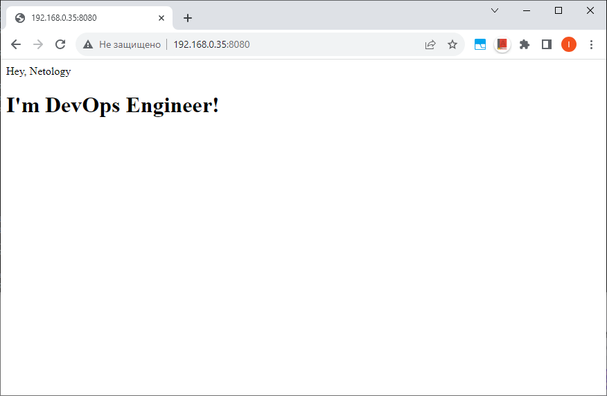

## Задача 1

Создаем Dockerfile и html файл: [Файлы здесь](01)


Собираем образ:
```
docker build -t netology-05-virt-03-docker-01-nginx:latest .
```

Смотрим на текущие образы:
```
docker images
```

Запуск контейнера, на базе собранного образа:
```
docker run -p 8080:80 -d --name nginx netology-05-virt-03-docker-01-nginx:latest
```

Смотрим, что контейнер запустился:
```
docker ps
```

Проверяем работоспособность:


Перед загрузкой образа в удаленный репозиторий необходимо в него влогиниться. Ввести учетную запись от [hub.docker.com](https://hub.docker.com/):
```
docker login
```

На основании нашего образа создадим его копию, указав префикс, который позволит выгрузить
образ в репозиторий, в который есть доступ:
```
docker tag netology-05-virt-03-docker-01-nginx:latest zxbit/netology-05-virt-03-docker-01-nginx:latest
```

Загружаем образ в удаленный репозиторий:
> Нет необходимости предварительно вручную создавать репозиторий, он создастся автоматически при выполнении команды push
```
docker push zxbit/netology-05-virt-03-docker-01-nginx:latest
```

#### Проверим запуск контейнера на основании загруженного нами образа из удаленного репозитория

Остановим и удалим все контейнеры, которые запущены на базе образа, в имени которого присутствует "netology-05-virt-03":
```
docker ps -a | grep "netology-05-virt-03" | awk '{print $1}' | xargs docker rm -f
```

Удалим все образы в имени которых присутствует "netology-05-virt-03":
```
docker images -a | grep "netology-05-virt-03" | awk '{print $3}' | xargs docker rmi -f
```

Запустим образ на базе контейнера из удаленного репозитория:
```
docker run -p 8080:80 -d --name nginx zxbit/netology-05-virt-03-docker-01-nginx:latest
```

Смотрим, что контейнер запустился
```
docker ps
```

Проверяем работоспособность:
```
По аналогии, как делали до этого
```

[Ссылка на репозиторий с образом](https://hub.docker.com/repository/docker/zxbit/netology-05-virt-03-docker-01-nginx/general)

#### Полезные команды
Удалить все остановленные контейнеры:
```
docker rm -v $(docker ps -aq -f status=exited)
```

Удалить образ по id:
```
docker rmi 7ce2db971101
```

Остановить контейнер по имени:
```
docker stop nginx
```

Запустить контейнер по имени:
```
docker start nginx
```

Удалить контейнер по имени, в том числе запущенный:
```
docker rm -f nginx
```

-----------------
## Задача 2

#### Высоконагруженное монолитное Java веб-приложение;
В зависимости от конкретных потребностей и контекста проекта, использование Docker вполне может быть оправданным даже для высоконагруженных монолитных Java веб-приложений. Решение о том, использовать Docker, виртуальную машину или физический сервер, часто зависит от компромиссов между изоляцией, управлением ресурсами, удобством развертывания и другими факторами.

Для "высоконагруженного монолитного Java веб-приложения" можно использовать комбинацию виртуальных машин (Virtual Machines, VM) и контейнеров Docker, в зависимости от конкретных требований и характеристик приложения.

В большинстве случаев наиболее предпочтительным вариантом будет использование виртуальных машин или выделенных серверов. Однако, конечное решение зависит от конкретных требований проекта. В некоторых ситуациях Docker контейнеры могут также предоставить значительные преимущества в удобстве развертывания, масштабируемости и управлении ресурсами. Важно учитывать конкретные требования приложения.

#### Nodejs веб-приложение:
Docker контейнеры предоставляют оптимальный баланс между легковесной виртуализацией и удобством управления, что часто делает их предпочтительным решением для развертывания Node.js веб-приложений.

#### Мобильное приложение c версиями для Android и iOS:
Для разработки и тестирования мобильных приложений с версиями для Android и iOS, использование Docker контейнеров обычно не является типичным сценарием. Вместо этого, для этих целей обычно используются эмуляторы, симуляторы, виртуальные машины и физические устройства. Выбор между эмуляторами, виртуальными машинами и физическими устройствами зависит от конкретных потребностей, предпочтений и ресурсов.

#### Шина данных на базе Apache Kafka:
Для Apache Kafka, часто предпочтительным подходом является использование физических серверов или виртуальных машин, особенно если производительность и контроль над ресурсами являются ключевыми критериями. Виртуальные машины могут предоставить гибкость масштабирования и управления, а физические сервера - высокую производительность. Продюсеры и консюмеры могут быть реализованы на базе Docker контейнеров для удобного масштабирования производительности целевого приложения, использующего Apache Kafka.

#### Elasticsearch-кластер (три ноды elasticsearch, два logstash и две ноды kibana):
Для данного сценария существует несколько вариантов развертывания в зависимости от требований проекта.

- Для тестирования и разработки, Docker контейнеры могут быть удобным выбором, обеспечивая быстрое развертывание и управление состоянием кластера.
- Виртуальные машины могут быть предпочтительными, если требуется более точное управление ресурсами или если у нас есть определенные требования к операционной системе.
- Физические машины могут быть рассмотрены для производственного окружения, особенно если кластер Elasticsearch сталкивается с высокими нагрузками и требует выделенных ресурсов.
- Иногда оптимальным решением может быть комбинированный подход, используя, например, Docker для Elasticsearch и Logstash, а виртуальные машины или физические машины для Kibana, в зависимости от требований к производительности и изоляции.

Окончательный выбор будет зависеть от конкретных потребностей проекта, требований к производительности и управления ресурсами.

#### Мониторинг-стек на базе Prometheus и Grafana:
Разворачивание стека мониторинга, включающего в себя Prometheus и Grafana, с использованием Docker контейнеров является распространенной и удобной практикой. Docker обеспечивает легковесное и консистентное развертывание приложений в изолированных контейнерах, что делает его популярным выбором для создания и управления микросервисами, в том числе инструментами мониторинга в различных средах, включая разработку, тестирование и производство.

#### MongoDB как основное хранилище данных для Java-приложения:
Многие компании успешно используют Docker контейнеры для развертывания MongoDB. Использование Docker обеспечивает простоту и эффективность в разворачивании MongoDB, делая этот процесс более удобным и легким в управлении. Контейнеры предоставляют изоляцию для MongoDB и ее компонентов, создавая стабильное окружение для работы базы данных.

Этот подход обладает несколькими преимуществами, включая удобство масштабирования, легкость управления конфигурацией и изоляцию ресурсов. Он также упрощает процессы разработки, тестирования и развертывания, делая MongoDB более гибкой и подходящей для различных сред.

#### Gitlab-сервер для реализации CI/CD-процессов и приватный (закрытый) Docker Registry:
В случае Gitlab-сервера и приватного Docker Registry, использование Docker контейнеров позволяет быстро развернуть и масштабировать эти сервисы, обеспечивая легкость в управлении и изоляцию. Этот подход также облегчает обновления и управление зависимостями. При этом выбор может зависеть от конкретных требований проекта и предпочтений команды:

- Если важна гибкость и быстрое развертывание: Docker может быть хорошим выбором, особенно если мы стремимся к контейнеризации CI/CD процессов и использованию приватного Docker Registry.

- Если нам нужны уровень изоляции и высокий контроль над ресурсами: Виртуальная машина может предоставить более высокий уровень изоляции по сравнению с Docker, сохраняя при этом некоторую гибкость.

- Если нужна максимальная производительность и у нас есть выделенные физические ресурсы: Физический сервер может быть наилучшим выбором для критичных по производительности CI/CD процессов и приватного Docker Registry.

Важно учитывать также требования к безопасности, управлению, масштабируемости и бюджету проекта при принятии окончательного решения.

-----------------
## Задача 3

> При монтировании локальной папки необходимо указать абсолютный путь до нее. Этого можно достичь используя переменную окружения $PWD. Если при подключении локальная папка будет отсутствовать по указанному пути, она создастся.

#### Контейнер из образа ***centos***:
```
docker run -t -d --name centos -v $PWD/data:/data centos:7
```

#### Контейнер из образа ***debian***:
```
docker run -t -d --name debian -v $PWD/data:/data debian:12.2
```

#### Посмотрим список запущенных контейнеров:
```
kiv@netology:~/homeworks/virtd-homeworks/05-virt-03-docker/03$ docker ps
CONTAINER ID   IMAGE         COMMAND       CREATED          STATUS          PORTS     NAMES
1b37cc356ca7   debian:12.2   "bash"        4 seconds ago    Up 3 seconds              debian
aea045b5d775   centos:7      "/bin/bash"   18 seconds ago   Up 18 seconds             centos
```

#### Подключимся к контейнеру ***centos*** и создадим файл в папке /data:
```
kiv@netology:~/homeworks/virtd-homeworks/05-virt-03-docker/03$ docker exec -it centos bash
[root@aea045b5d775 /]# cd data
[root@aea045b5d775 data]# ls -la
total 8
drwxrwxr-x 2 1000 1000 4096 Nov 18 21:09 .
drwxr-xr-x 1 root root 4096 Nov 18 21:10 ..
[root@aea045b5d775 data]# echo "Hi from centos" > centos.txt
[root@aea045b5d775 data]# exit
exit
```

#### На хостовой машине создаем файл в папке data:
```
kiv@netology:~/homeworks/virtd-homeworks/05-virt-03-docker/03$ echo "Hi from host" > data/host.txt
kiv@netology:~/homeworks/virtd-homeworks/05-virt-03-docker/03$ ls -la data/
total 16
drwxrwxr-x 2 kiv  kiv  4096 Nov 18 21:13 .
drwxrwxr-x 3 kiv  kiv  4096 Nov 18 20:55 ..
-rw-r--r-- 1 root root   15 Nov 18 21:11 centos.txt
-rw-rw-r-- 1 kiv  kiv    13 Nov 18 21:13 host.txt
```

#### Подключимся к контейнеру ***debian*** и посмотрим на файлы в папке /data:
```
kiv@netology:~/homeworks/virtd-homeworks/05-virt-03-docker/03$ docker exec -it debian bash
root@1b37cc356ca7:/# cd data
root@1b37cc356ca7:/data# ls -la
total 16
drwxrwxr-x 2 1000 1000 4096 Nov 18 21:13 .
drwxr-xr-x 1 root root 4096 Nov 18 21:10 ..
-rw-r--r-- 1 root root   15 Nov 18 21:11 centos.txt
-rw-rw-r-- 1 1000 1000   13 Nov 18 21:13 host.txt
root@1b37cc356ca7:/data# cat centos.txt
Hi from centos
root@1b37cc356ca7:/data# cat host.txt
Hi from host
root@1b37cc356ca7:/data#
```

-----------------
## Задача 4

