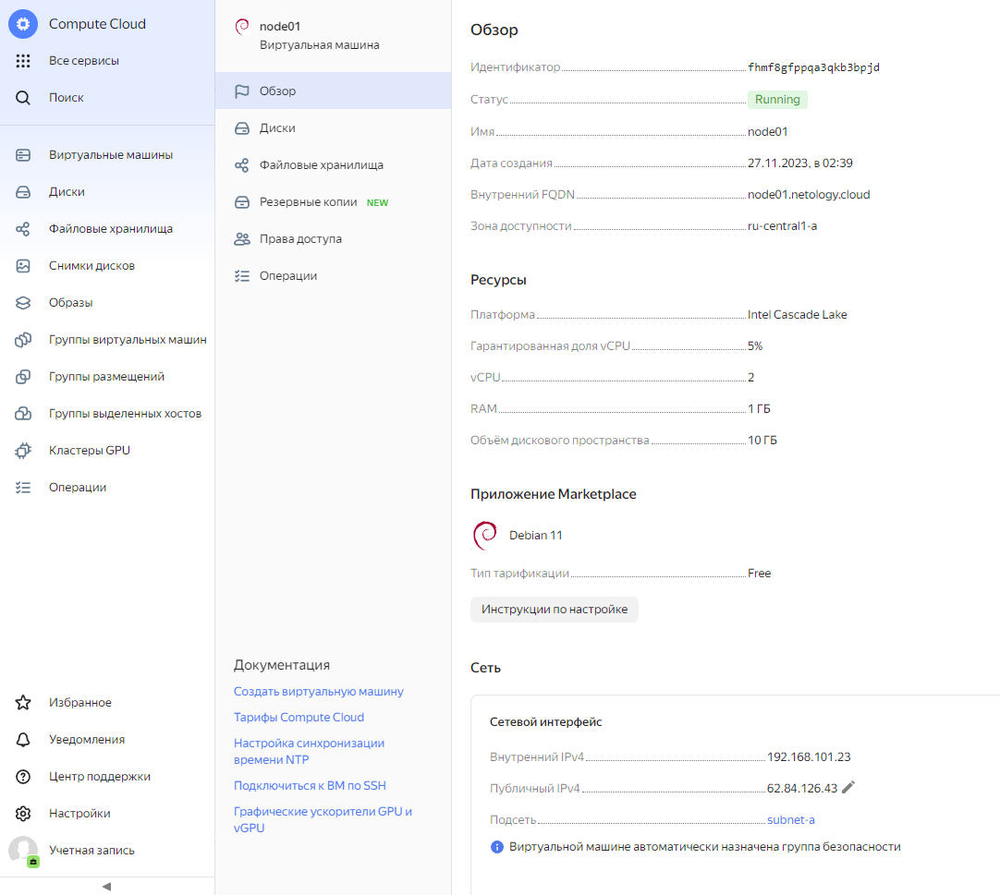
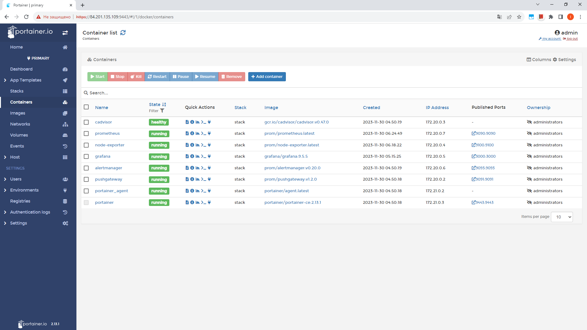

## Задача 1
Созданный образ в консоле


Созданный образ из личного кабинета Yandex Cloud


## Задача 2 (2.1, 2.2*)
terraform init


terraform apply


Свойства ноды в Yandex Cloud



## Задача 3
docker ps


Также на стек развернут Portainer



## Задачи 4, 5*
Предложенный стек был переработан:

```
1. Хосты развернуты на базе debian-11
2. Обновлен плейбук ansible для разворачивания docker, docker-compose на debian
3. Обновлены grafana, prometheus (т.к. не поддерживает синтаксис запросов, используемых в новом дашборде) и node-exporter
4. В grafana добавлен новый dashboard Node Exporter Full: https://grafana.com/grafana/dashboards/1860-node-exporter-full/
5. Добавлен Portainer для работы с docker
6. Убран caddy (т.к. контейнер с ним не запускается, падает с ошибками про go)
```

Ноды в Yandex Cloud


Статистика node01 в grafana, дашборд Node Exporter Full


Статистика node02 в grafana, дашборд Node Exporter Full


Список хостов в выпадающем списке дашборда


