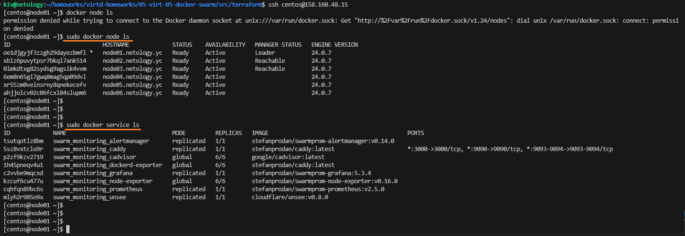
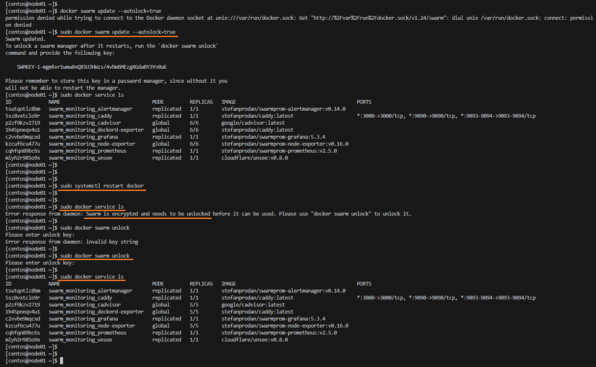

## Задача 1

#### В чём отличие режимов работы сервисов в Docker Swarm-кластере: replication и global?
В Docker Swarm существуют два режима развертывания сервисов: репликация и глобальная развертка. Режим репликации предполагает указание фиксированного количества реплик контейнеров для развёртывания в кластере. Например, команда
```
docker service create --name my-web-app --replicas 5 -p 80:80 my-web-image
```
создаёт сервис с пятью репликами веб-сервера.

В режиме глобальной развертки на каждом узле кластера автоматически создаётся по одному экземпляру контейнера сервиса. Например, команда
```
docker service create --name my-logger --mode global my-logger-image
```
создаёт сервис с глобальной разверткой, обеспечивая один экземпляр контейнера на каждом узле.

Оба режима обеспечивают высокую доступность и управление состоянием контейнеров в кластере, при этом режим репликации подходит для задач с фиксированным числом экземпляров, а глобальная развертка - для обеспечения однородности задач на всех узлах.

#### Какой алгоритм выбора лидера используется в Docker Swarm-кластере?
До версии Docker 1.12 (включительно) в Swarm для выбора лидера использовался алгоритм поколений и таймеров (Generational and Time-based algorithm). Этот алгоритм опирался на выбор лидера на основе временных интервалов и поколений, что позволяло распределённой системе эффективно обнаруживать сбои.

После Docker 1.12 было принято решение о переходе на алгоритм Raft. Этот алгоритм обеспечивает надёжное определение лидера, который управляет состоянием кластера. В Raft каждый узел в кластере может быть в одном из трех состояний: лидер, кандидат или последователь. Лидер обрабатывает все запросы от клиентов и реплицирует своё состояние на других узлах. Если текущий лидер выходит из строя, происходит выбор нового лидера. Работа алгоритма Raft в Docker Swarm обеспечивает отказоустойчивость и надёжность управления состоянием кластера, что важно для высокой доступности и эффективного распределённого выполнения задач.

#### Что такое Overlay Network?
Overlay Network в Docker Swarm представляет собой виртуальный механизм сети, который позволяет контейнерам взаимодействовать между собой, даже если они размещены на различных узлах кластера. Создавая абстрактный слой поверх физической сети, Overlay Network обеспечивает мультихостовость и изоляцию, что делает его подходящим для распределённых приложений.

Контейнеры могут динамически присоединяться к Overlay Network при создании, что обеспечивает гибкость в управлении сетевой конфигурацией. Механизм также поддерживает надёжное и отказоустойчивое взаимодействие между узлами кластера с использованием алгоритмов маршрутизации, таких как VXLAN.

## Задачи 2, 3

Вывод команд:
```
sudo docker node ls
sudo docker service ls
```



## Задача 4*
Опция --autolock=true включает автоматическую блокировку для лидера Swarm. Когда функция автоматической блокировки включена, лидер будет автоматически блокироваться после перезапуска, переключения или других событий, что помогает усилить безопасность кластера.

Блокировка лидера Swarm означает, что для его разблокировки потребуется ввод предварительно установленного ключа. Это обеспечивает дополнительный уровень безопасности для критически важных операций в кластере, таких как добавление или удаление узлов, изменение параметров кластера и другие административные действия.


