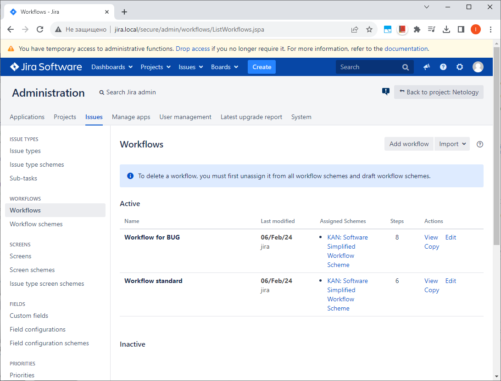
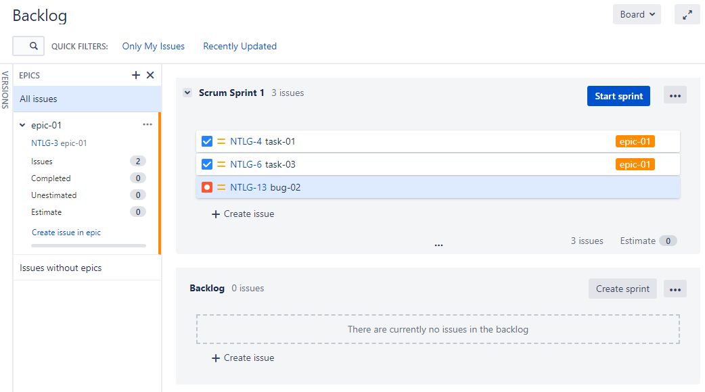

## Домашнее задание

https://github.com/netology-code/mnt-homeworks/blob/MNT-video/09-ci-01-intro

## Решение

Список добавленных Workflows

### Workflow для задач типа Bug:

[xml](xml/Workflow%20for%20BUG.xml)

Diagram view

Text view

### Workflow для остальных типов задач:

[xml](xml/Workflow%20standard.xml)

Diagram view

Text view

---

Спринт с активными задачами

