## Домашнее задание

https://github.com/netology-code/mnt-homeworks/blob/MNT-video/09-ci-04-jenkins/README.md

## Jenkins agent

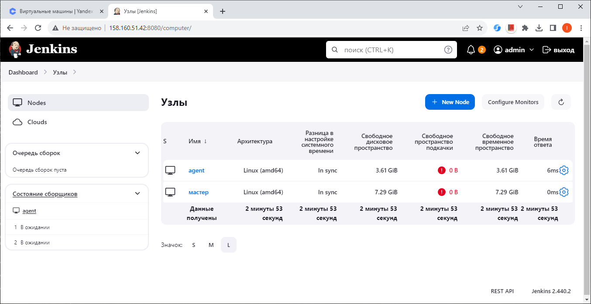

## Версии ПО на Jenkins agent

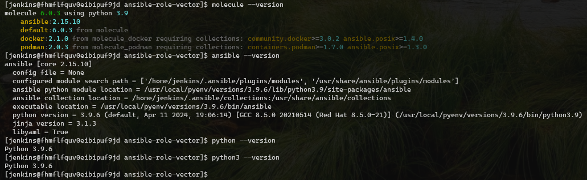

## Freestyle Pipeline

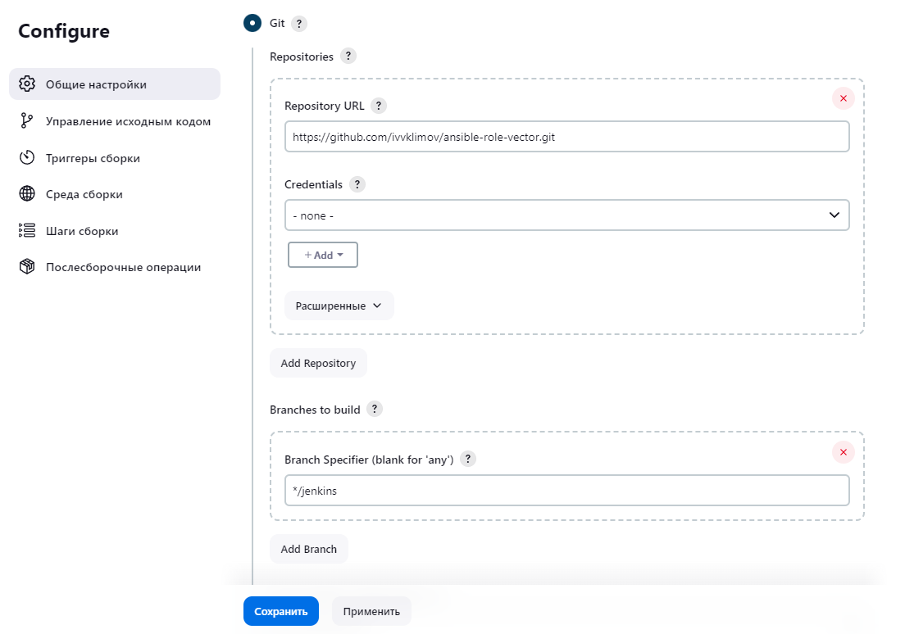

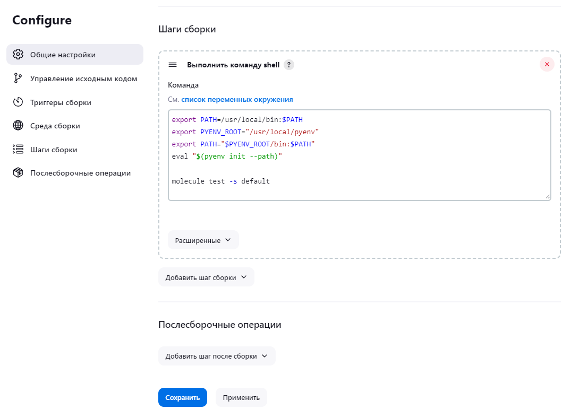

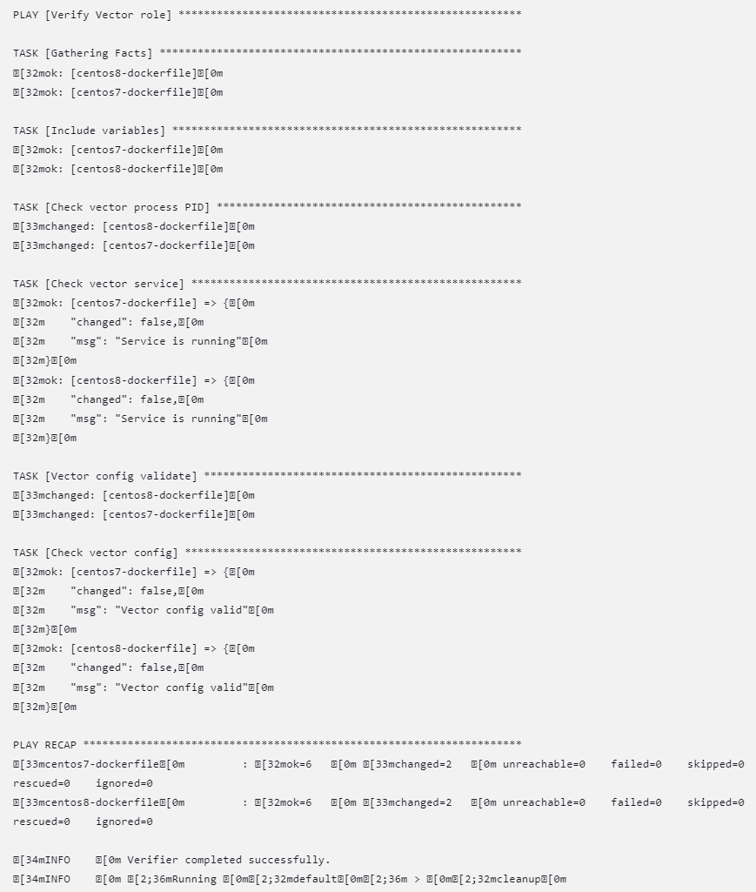

## Declarative Pipeline

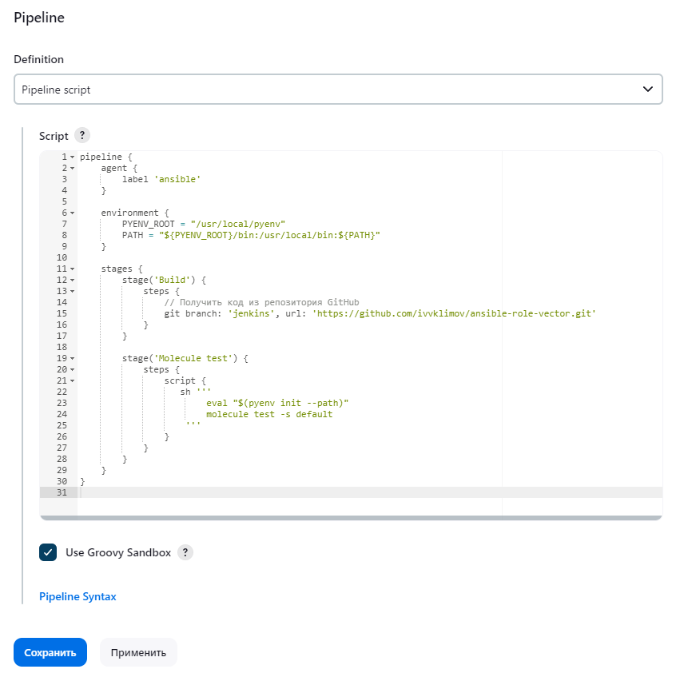

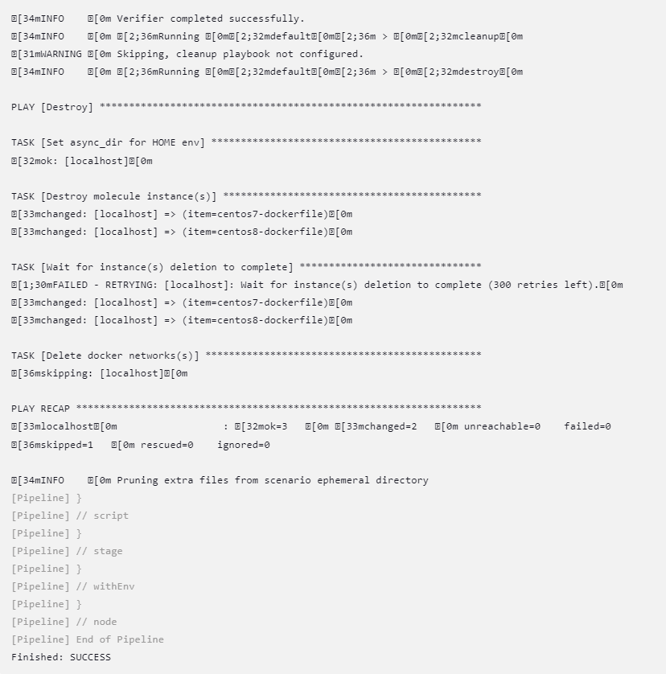

## Declarative Pipeline with Jenkinsfile

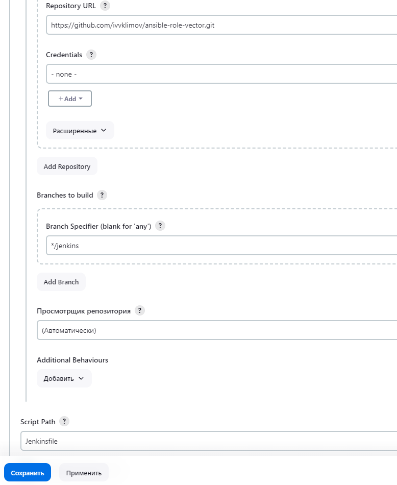

[Declarative Pipeline](https://github.com/ivvklimov/ansible-role-vector/blob/1.0.3/Jenkinsfile)

## Multibranch Pipeline

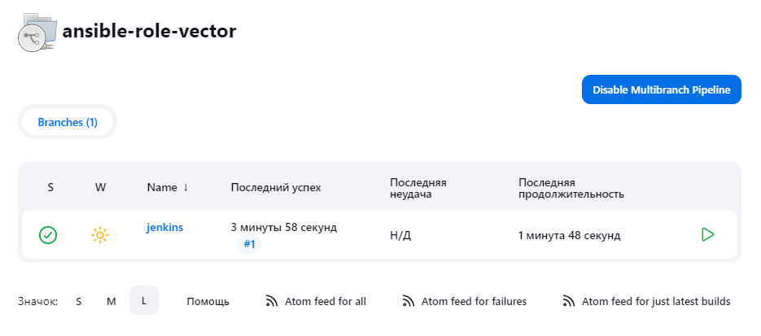

## Scripted Pipeline

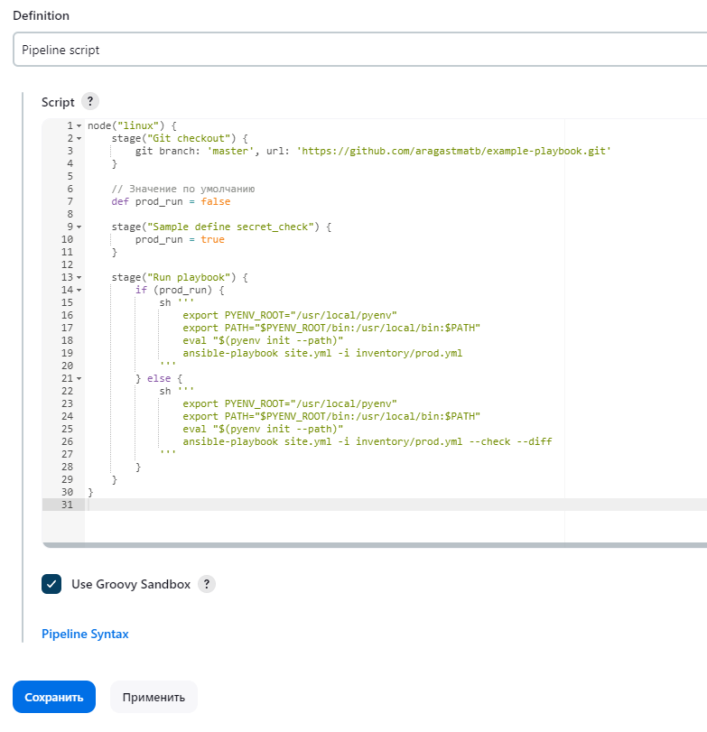

run_prod = true

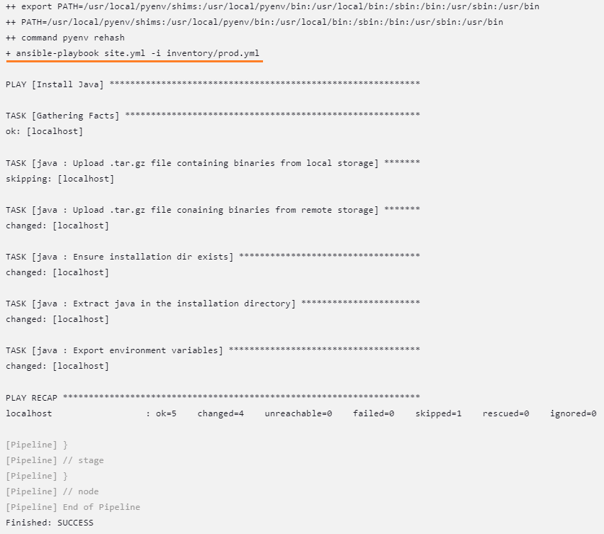

run_prod = false (default)

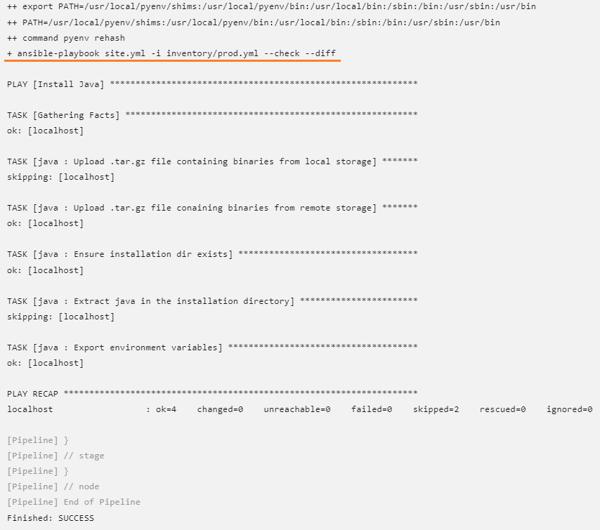

[Scripted Pipeline](ScriptedJenkinsfile)

## Molecule for ansible-role-vector

[default (1.0.3)](https://github.com/ivvklimov/ansible-role-vector/tree/1.0.3/molecule/default)
