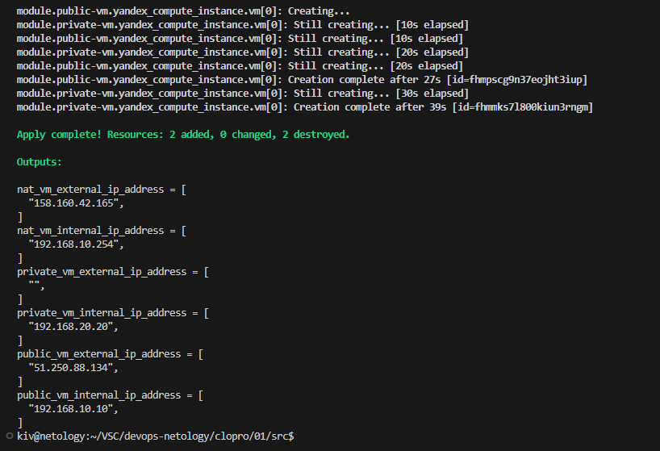
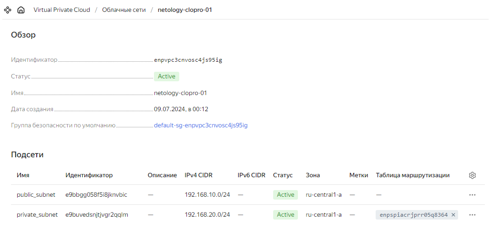
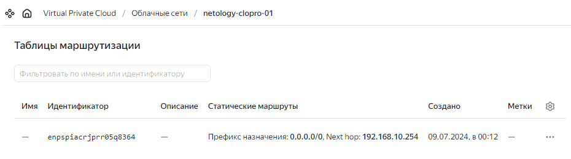
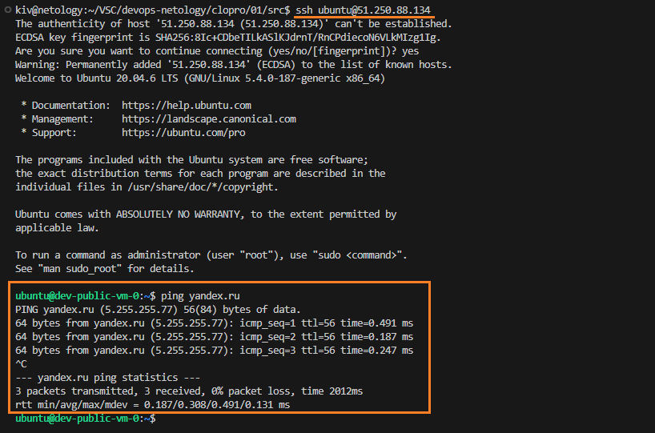
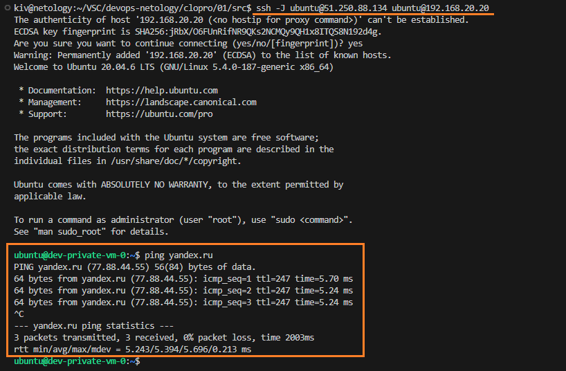

## Домашнее задание

https://github.com/netology-code/clopro-homeworks/blob/main/15.1.md


# Задание 1: Yandex Cloud

Разворачиваем инфраструктуру

```
terraform init
terraform apply
```



Подсети



Таблица маршрутизации



Подключаемся к public-vm через ее внешний ip и пингуем yandex.ru



Подключаемся к private-vm через public-vm и пингуем yandex.ru



private-vm получает доступ в инет через nat
