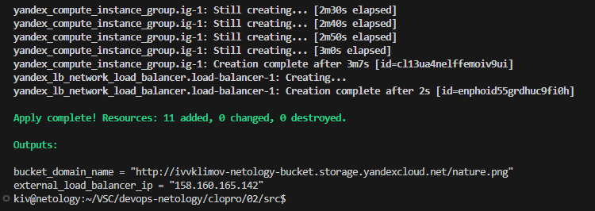
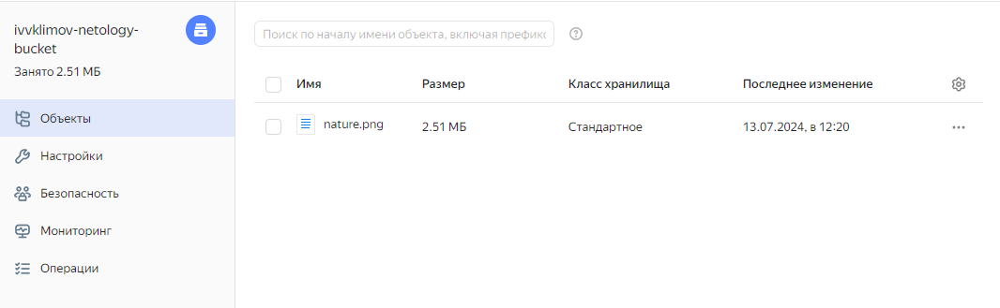
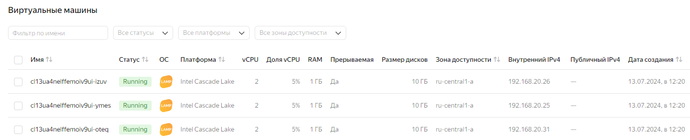
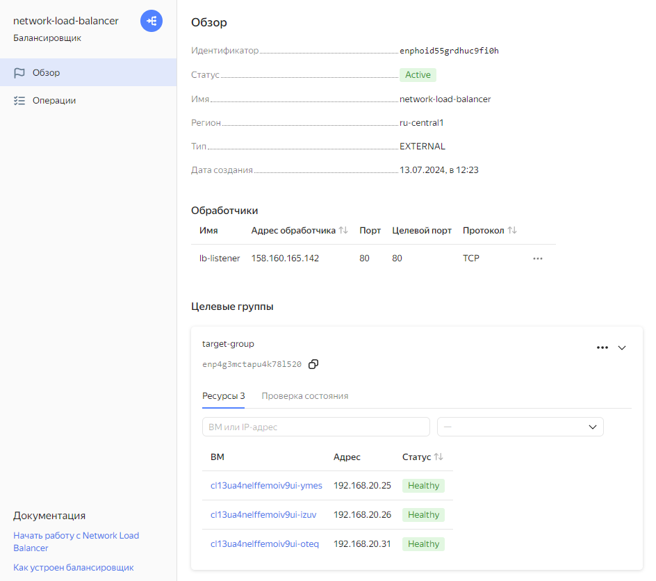
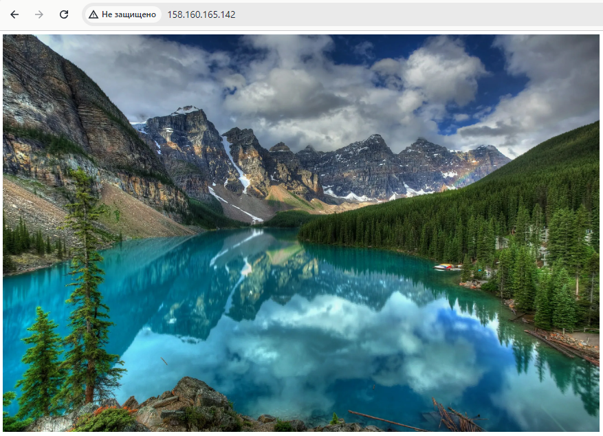
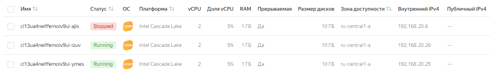

## Домашнее задание

https://github.com/netology-code/clopro-homeworks/blob/main/15.2.md


# Задание 1: Yandex Cloud

Разворачиваем инфраструктуру

```
terraform init
terraform apply
```

Outputs



Бакет



Ссылка для скачивания: \
https://storage.yandexcloud.net/ivvklimov-netology-bucket/nature.png


VM

```
Хосты развернуты в приватной сети без доступа к инету, доступ к ним будет осуществляться через балансировщик.
```




Балансировщик и целевая группа



Пробуем открыть картинку, на данный момент за балансировщиком у нас 3 запущенных хоста



Останавливаем одну VM



И повторно пробуем открыть картинку, на данный момент за балансировщиком у нас 2 запущенных хоста


Картинка открывается
