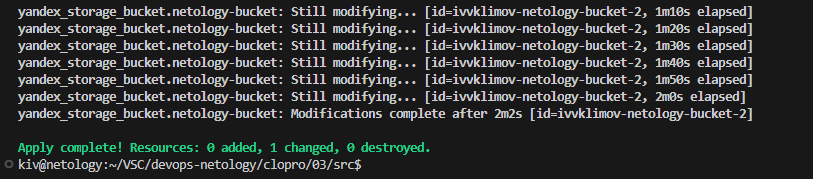
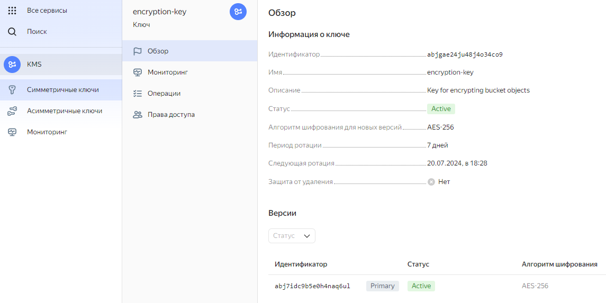
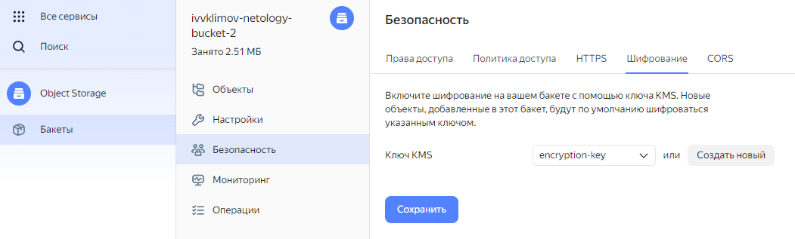
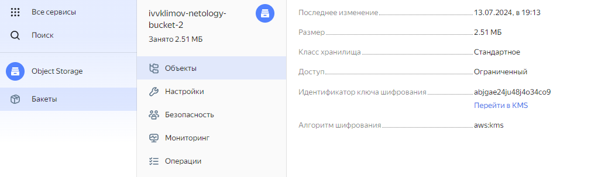

## Домашнее задание

https://github.com/netology-code/clopro-homeworks/blob/main/15.2.md


# Задание 1: Yandex Cloud

Применяем изменения

```
terraform init
terraform apply
```



KMS ключ



Включено шифрование бакета



Зашифрованный объект в бакете


