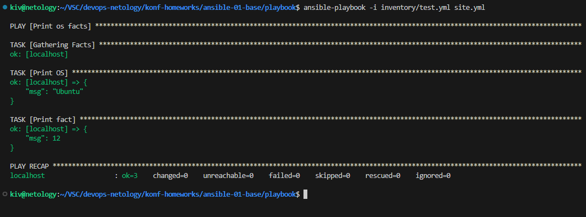
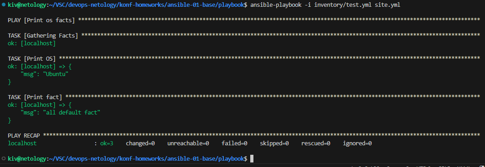
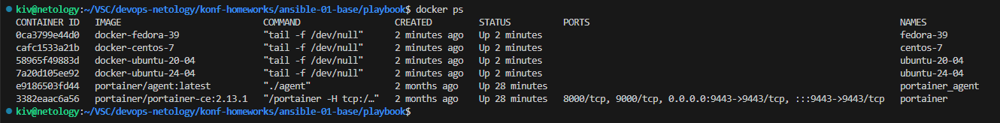
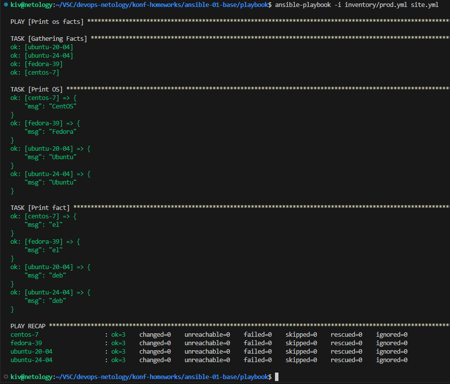
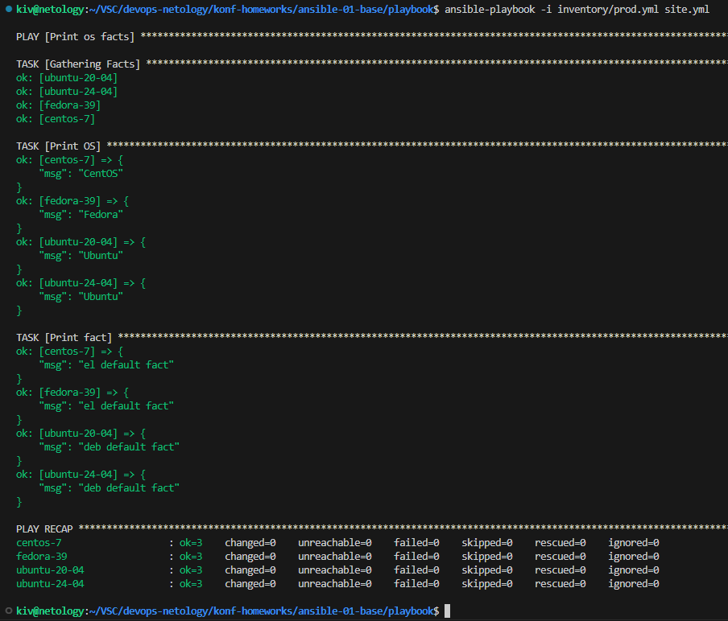
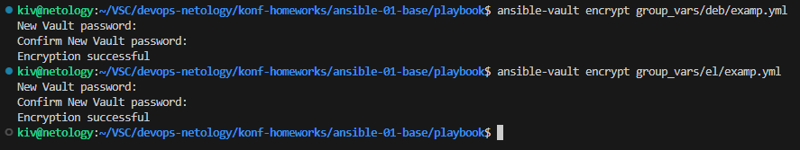
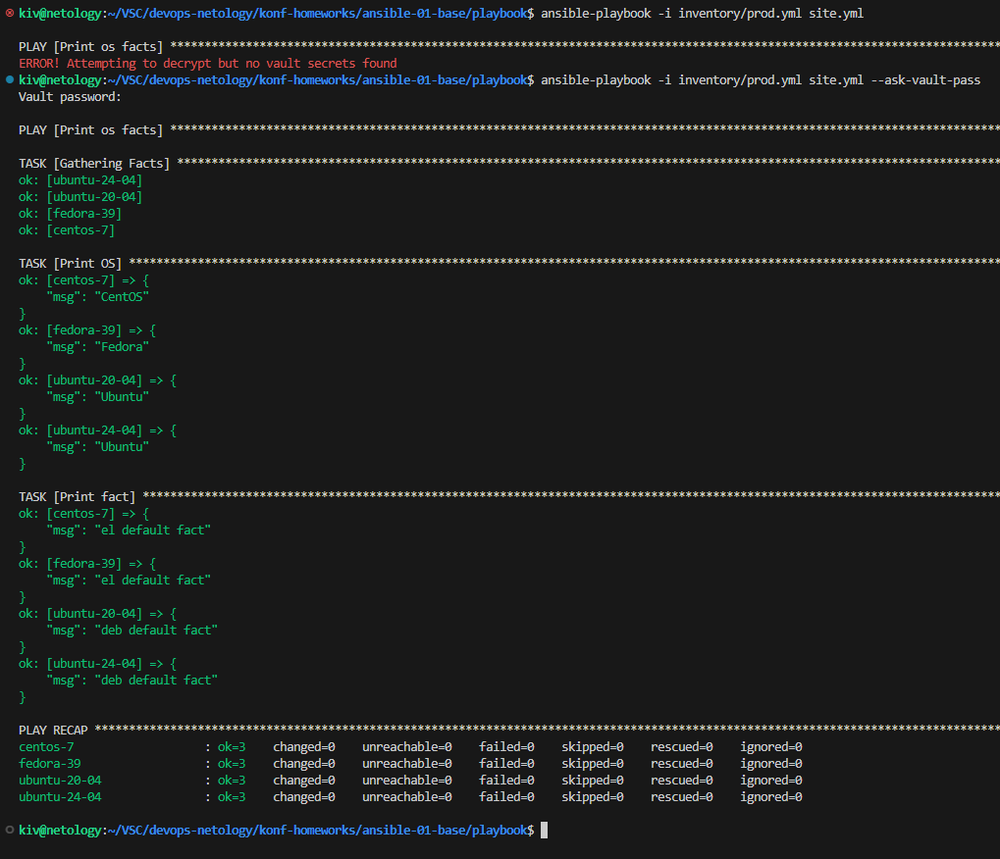
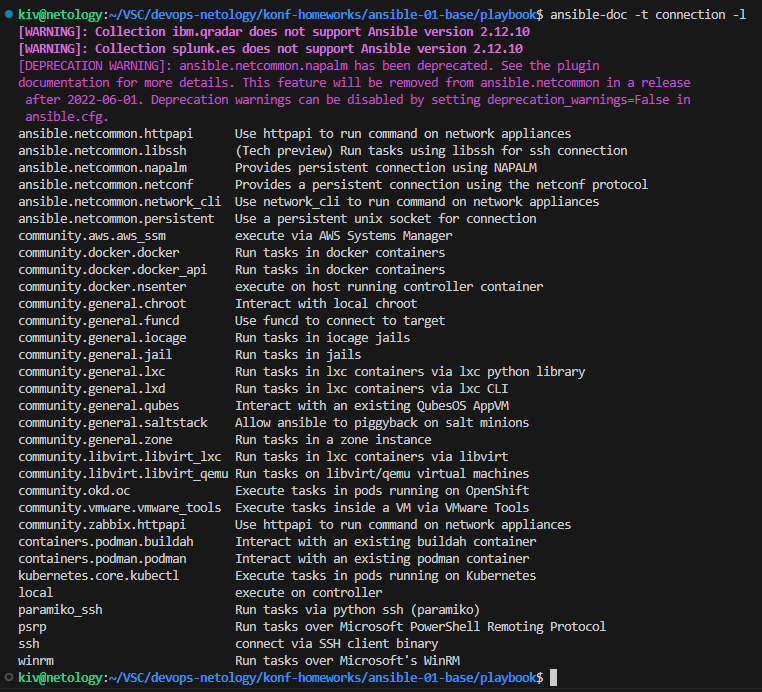
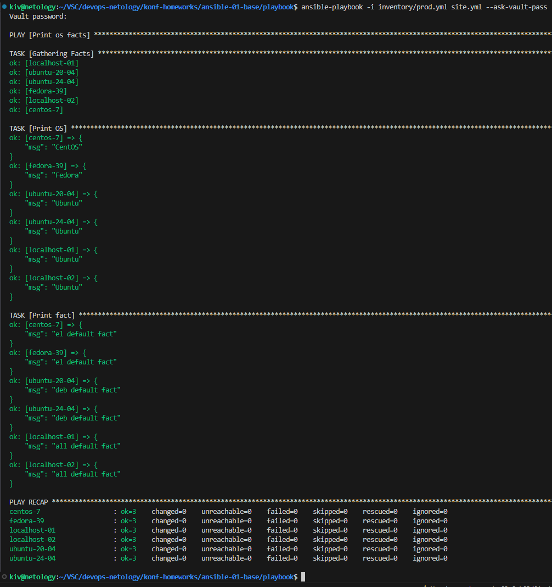

## Домашнее задание

https://github.com/netology-code/mnt-homeworks/tree/MNT-video/08-ansible-01-base

# Основная часть

## Задача 1
*Попробуйте запустить playbook на окружении из test.yml, зафиксируйте значение, которое имеет факт some_fact для указанного хоста при выполнении playbook.*

```
ansible-playbook -i inventory/test.yml site.yml
```



## Задача 2
*Найдите файл с переменными (group_vars), в котором задаётся найденное в первом пункте значение, и поменяйте его на all default fact.*



## Задача 3
*Воспользуйтесь подготовленным (используется docker) или создайте собственное окружение для проведения дальнейших испытаний.*

[docker](docker)



## Задача 4
*Проведите запуск playbook на окружении из prod.yml. Зафиксируйте полученные значения some_fact для каждого из managed host.*

```
ansible-playbook -i inventory/prod.yml site.yml
```



## Задача 5
*Добавьте факты в group_vars каждой из групп хостов так, чтобы для some_fact получились значения: для deb — deb default fact, для el — el default fact.*

[deb](playbook/group_vars/deb/examp.yml)

[el](playbook/group_vars/el/examp.yml)

## Задача 6
*Повторите запуск playbook на окружении prod.yml. Убедитесь, что выдаются корректные значения для всех хостов.*

```
ansible-playbook -i inventory/prod.yml site.yml
```



## Задача 7
*При помощи ansible-vault зашифруйте факты в group_vars/deb и group_vars/el с паролем netology.*

```
ansible-vault encrypt group_vars/deb/examp.yml
ansible-vault encrypt group_vars/el/examp.yml
```



## Задача 8
*Запустите playbook на окружении prod.yml. При запуске ansible должен запросить у вас пароль. Убедитесь в работоспособности.*

```
ansible-playbook -i inventory/prod.yml site.yml
ansible-playbook -i inventory/prod.yml site.yml --ask-vault-pass
```



## Задача 9
*Посмотрите при помощи ansible-doc список плагинов для подключения. Выберите подходящий для работы на control node.*

```
ansible-doc -t connection -l
```



## Задача 10
*В prod.yml добавьте новую группу хостов с именем local, в ней разместите localhost с необходимым типом подключения.*

[prod.yml](playbook/inventory/prod.yml)

## Задача 11
*Запустите playbook на окружении prod.yml. При запуске ansible должен запросить у вас пароль. Убедитесь, что факты some_fact для каждого из хостов определены из верных group_vars.*


```
ansible-playbook -i inventory/prod.yml site.yml --ask-vault-pass
```



# Дополнительные задания

## Задача 1
*При помощи ansible-vault расшифруйте все зашифрованные файлы с переменными.*


## Задача 2
*Зашифруйте отдельное значение PaSSw0rd для переменной some_fact паролем netology. Добавьте полученное значение в group_vars/all/exmp.yml.*


## Задача 3
*Запустите playbook, убедитесь, что для нужных хостов применился новый fact.*


## Задача 4
*Добавьте новую группу хостов fedora, самостоятельно придумайте для неё переменную. В качестве образа можно использовать этот вариант.*


## Задача 5
*Напишите скрипт на bash: автоматизируйте поднятие необходимых контейнеров, запуск ansible-playbook и остановку контейнеров.*
