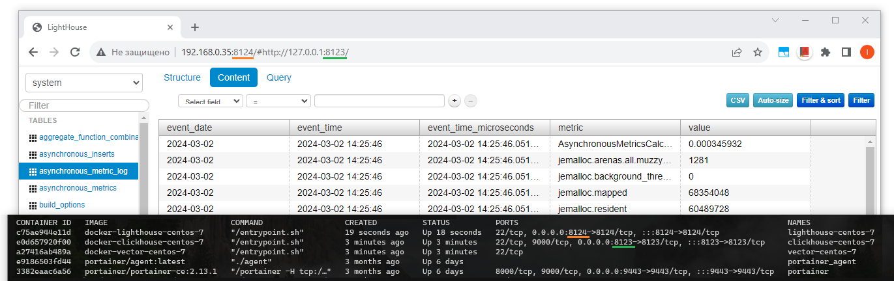

## Домашнее задание

https://github.com/netology-code/mnt-homeworks/tree/MNT-video/08-ansible-03-yandex

# Основная часть

## Inventory
[Inventory](playbook/inventory/prod.yml) состоит из виртуальных машин, запущенных в [docker](docker/docker-compose.yml).

[Образ](docker/centos/Dockerfile) для виртуальных машин построен на базе centos-7.

Centos, запущенная в docker имеет ограничения при работе с systemctl. Для того, чтобы обеспечить полноценную работу данной утилиты при сборке образа в него добавляется [systemctl.py](docker/systemctl.py)

Для запуска контейнеров используется [entrypoint.sh](docker/centos/entrypoint.sh), который создает пользователя ansible, добавляет его в sudo, по-необходимости создает серверные ssh ключи и запускает службу sshd. Для того, что каждый раз при перезапуске контейнеров не генерились новые серверные ssh ключи и не возникало сопутствующих сложностей с подключением по ssh в [docker-compose.yml](docker/docker-compose.yml) по месту хранения серверных ssh ключей монтируются тома, данные на которых сохраняются при перезапуске контейнеров.

## Ссылка на плейбук
[lighthouse.yml](playbook/lighthouse.yml)

## Параметры плейбука
lighthouse_vcs
```
Ссылка к репозиторию с исходным кодом lighthouse
```

lighthouse_local_dir
```
Папка, в которой будет установлен lighthouse, например:
lighthouse_local_dir: "/mnt/lighthouse"
```

## Теги плейбука
nginx
```
Используется для установки и настрйки nginx
```

lighthouse
```
Используется для установки и настрйки lighthouse
```

## Задачи плейбука

### Nginx
Установку nginx производим на основании [официальной документации](https://docs.nginx.com/nginx/admin-guide/installing-nginx/installing-nginx-open-source/#installing-a-prebuilt-centosrhel-oracle-linuxalmalinuxrocky-linux-package-from-an-os-repository).

**NGINX | Install the EPEL repository**
- Эта стадия предназначена для установки репозитория EPEL, который обеспечивает дополнительные пакеты для Enterprise Linux. Репозиторий EPEL часто требуется для установки пакетов, которые не входят в стандартный набор пакетов для дистрибутива Linux.

**NGINX | Update the repository**
- Эта стадия обновляет репозиторий, чтобы удостовериться, что информация о доступных пакетах актуальна.

**NGINX | Install NGINX Open Source**
- Здесь производится установка NGINX Open Source с использованием обновленного репозитория EPEL.

- Подключаем хук, который перезапустит nginx после его установки.

### Lighthouse
**Lighthouse| Install dependencies**
- Устанавливаем пакет git

**Lighthouse | Copy from git**
- Скачиваем с гита исходники lighthouse с ветки main и кладем по определенному в параметре lighthouse_local_dir пути.

**Lighthouse | Create ligthouse config**
- Собираем конфиг lighthouse для nginx на базе jinja2 шаблона и кладем по указанному пути.

- Подключаем хук, который будет перезапускать nginx при изменениях в данном конфиге.

## Screenshots

Запущенный lighthouse, подключенный к clickhouse


