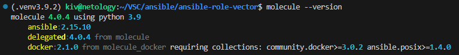
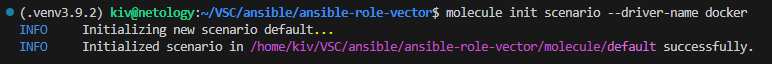
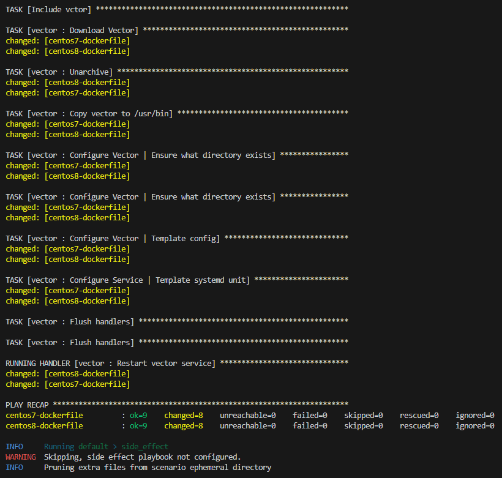
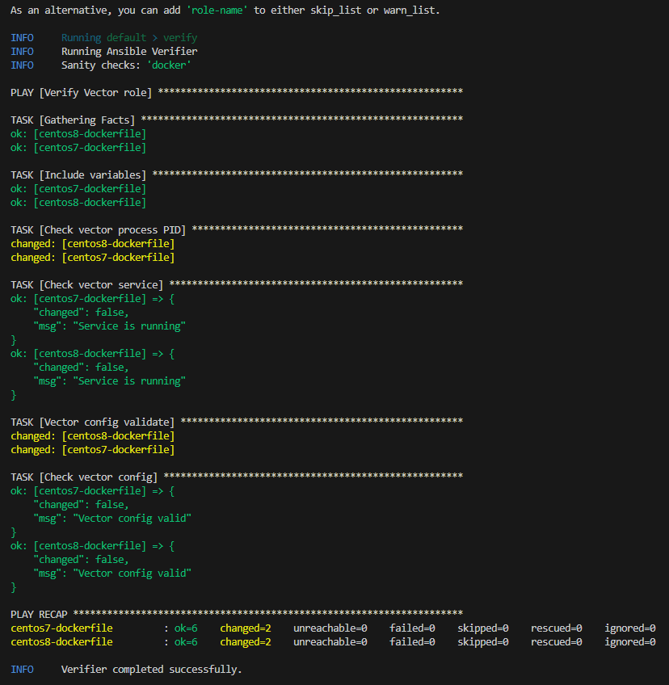
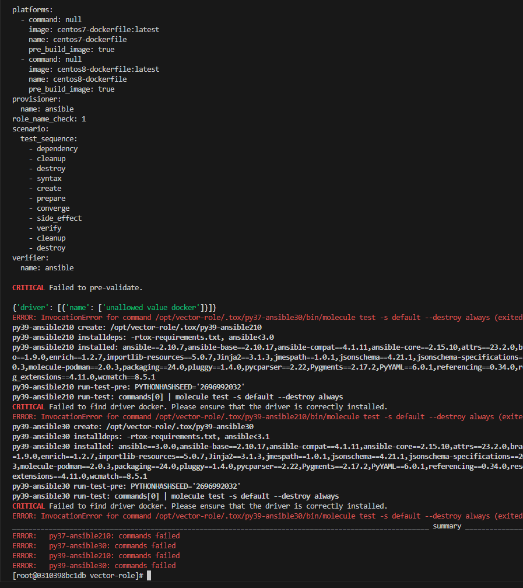
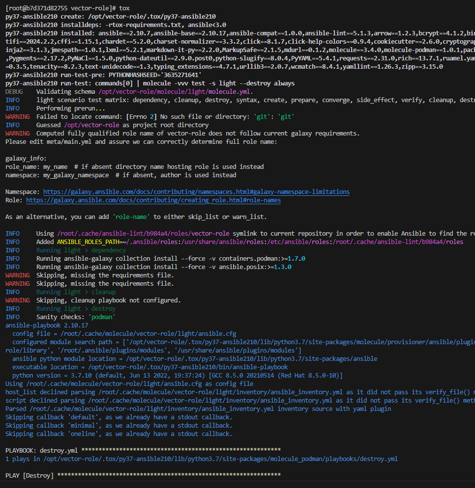

## Домашнее задание

https://github.com/netology-code/mnt-homeworks/tree/MNT-video/08-ansible-05-testing


## Описание
Тестирование ролей проводилось на [centos7](docker/centos7/Dockerfile) и [centos8](docker/centos8/Dockerfile), собранных на базе кастомных образов.

Centos, запущенная в docker имеет ограничения при работе с systemctl. Для того, чтобы обеспечить полноценную работу данной утилиты при сборке образа в него добавляется [systemctl.py](docker/systemctl.py)

Для запуска контейнеров используется [entrypoint.sh](docker/centos7/entrypoint.sh), который создает пользователя ansible, добавляет его в sudo, по-необходимости создает серверные ssh ключи и запускает службу sshd. 

> Необходимо обратить внимание на то, что после копирования папки [docker](docker) через Windows требуется сконвертить файлы systemctl.py, entrypoint.sh при помощи dos2unix утилиты перед сборкой образа с их участием.

## Molecule

Для того, чтобы предотвратить переопределение молекулой опции command при запуске docker образа в ее конфиге в секции platforms добавляется опция command: null.

molecule --version



molecule init scenario --driver-name docker



```
molecule test -s default
molecule test -s default --destroy=never
```

test



verify



## Tox

```
docker run --privileged=True -v ~/VSC/ansible/ansible-role-vector:/opt/vector-role -w /opt/vector-role -it aragast/netology:latest /bin/bash
```

docker



podman



[tox.ini (1.0.2)](https://github.com/ivvklimov/ansible-role-vector/blob/1.0.2/tox.ini)

## Molecule for ansible-role-vector

[default (1.0.2)](https://github.com/ivvklimov/ansible-role-vector/tree/1.0.2/molecule/default)

[light (1.0.2)](https://github.com/ivvklimov/ansible-role-vector/tree/1.0.2/molecule/light)
