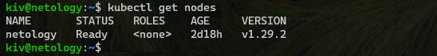
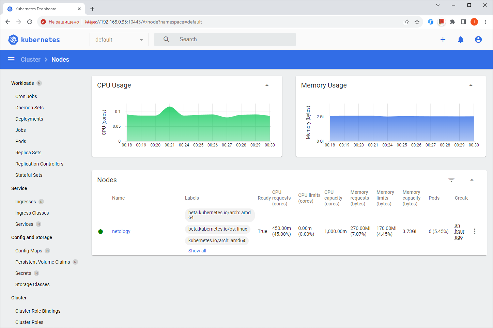
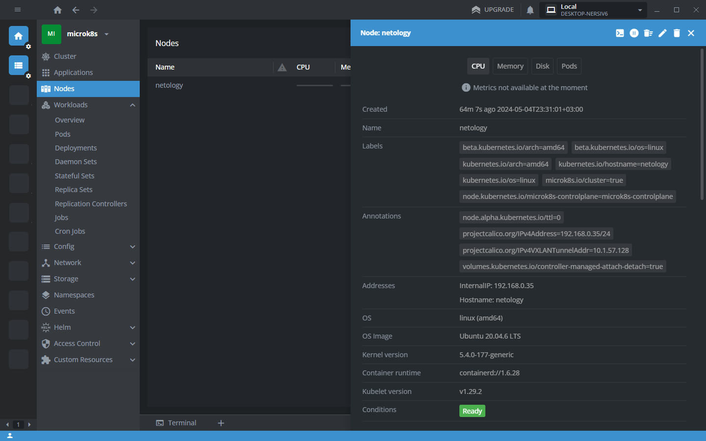

## Домашнее задание

https://github.com/netology-code/kuber-homeworks/blob/main/1.1/1.1.md

#### Установка MicroK8S

```
sudo apt update,
sudo apt install snapd
sudo snap install microk8s --classic
sudo usermod -a -G microk8s $USER
sudo chown -f -R $USER ~/.kube
newgrp microk8s
```

#### Установка kubectl

```
curl -LO https://storage.googleapis.com/kubernetes-release/release/`curl -s https://storage.googleapis.com/kubernetes-release/release/stable.txt`/bin/linux/amd64/kubectl
chmod +x ./kubectl
sudo mv ./kubectl /usr/local/bin/kubectl

echo 'source <(kubectl completion bash)' >> ~/.bashrc
source ~/.bashrc
```

#### kubectl get nodes



#### Пполучение текущего конфига

```
microk8s config
```

#### Получение токена

```
token=$(kubectl -n kube-system get secret | grep default-token | cut -d " " -f1)
kubectl -n kube-system describe secret $token
```

#### Посмотреть подключенные/доступные модули
```
microk8s status
```

#### Включить dashboard
```
microk8s enable dashboard
```

#### Проброс порта к dashboard
```
microk8s kubectl port-forward -n kube-system service/kubernetes-dashboard 10443:443 --address=0.0.0.0
```

#### Dashboard

```
Не пускает с конфигом, пускает с токеном
```




#### Lens

```
Пускает с конфигом
```


