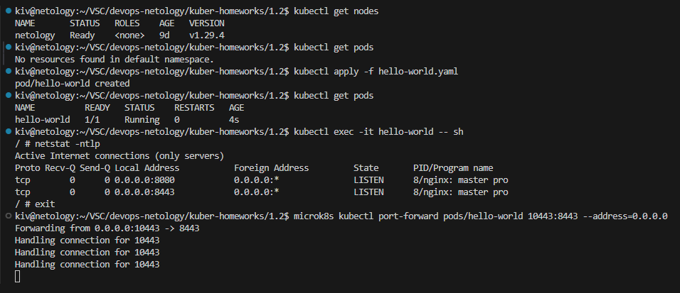
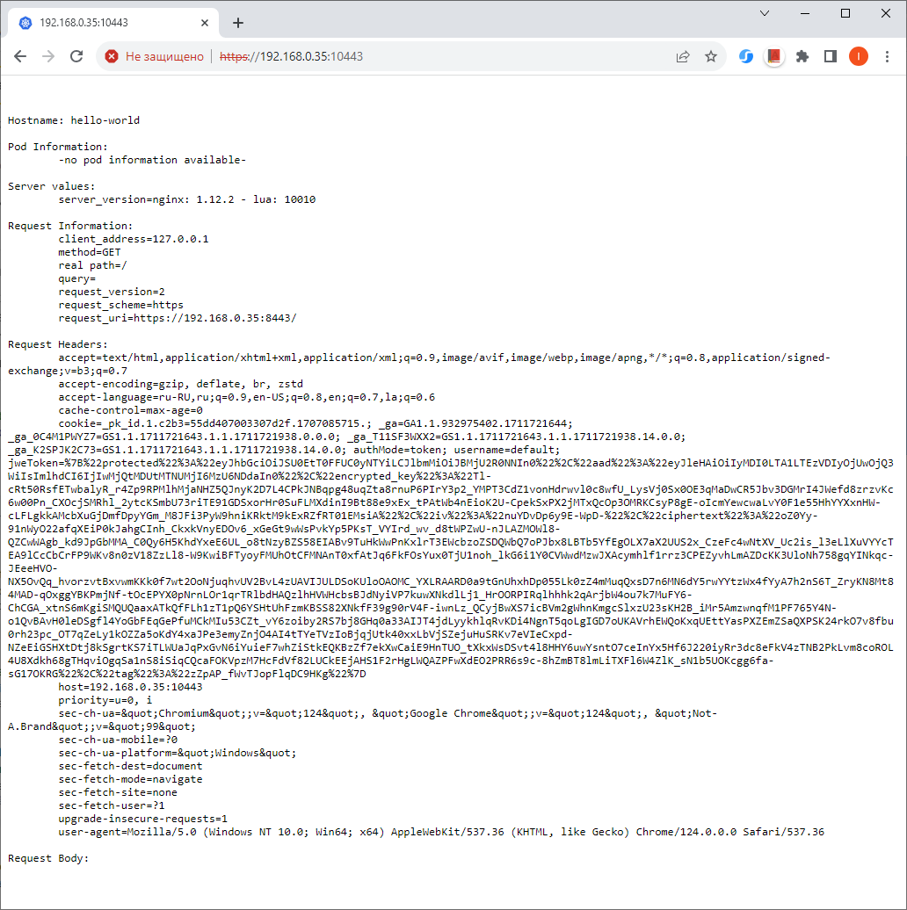
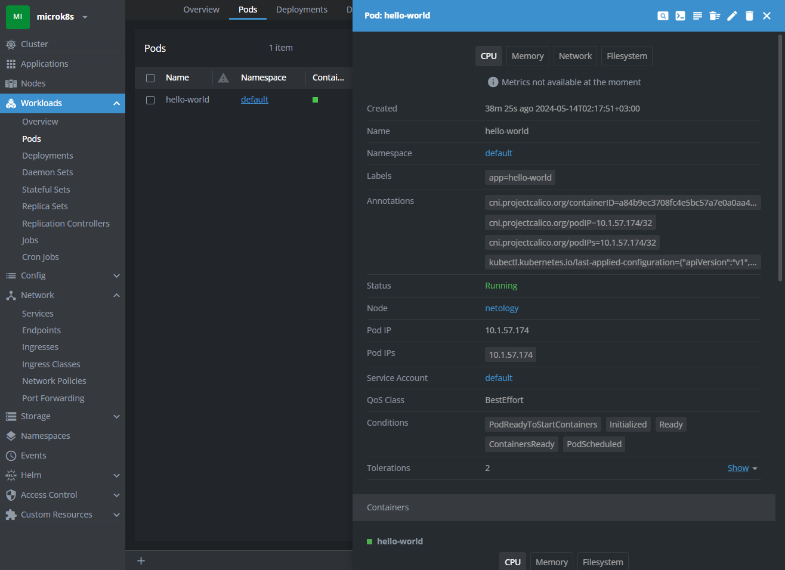
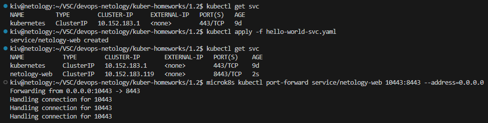
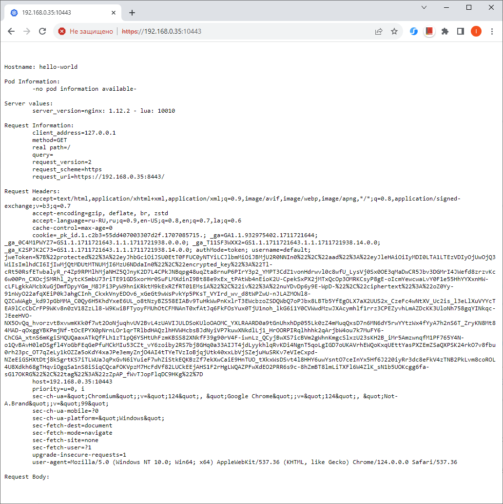
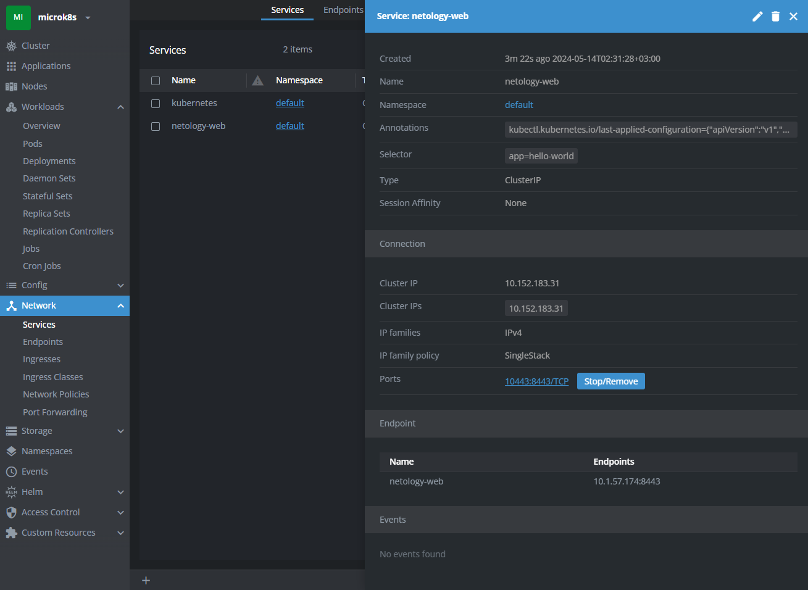

## Домашнее задание

https://github.com/netology-code/kuber-homeworks/blob/main/1.2/1.2.md

### Задание 1

Запуск пода и проброс порта

Проверка работоспособности в браузере

Просмотр запущенного пода в Lens

[hello-world.yaml](hello-world.yaml)

### Задание 2

Запуск сервиса и проброс порта

Проверка работоспособности в браузере

Просмотр запущенного сервиса в Lens

[hello-world-svc.yaml](hello-world-svc.yaml)
