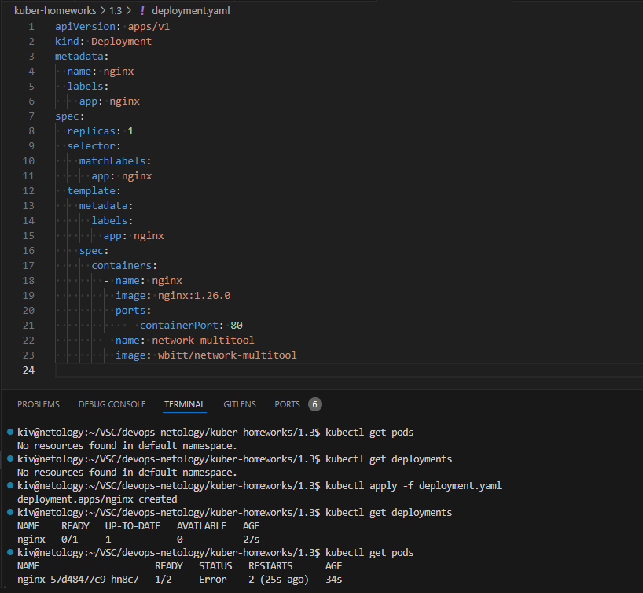
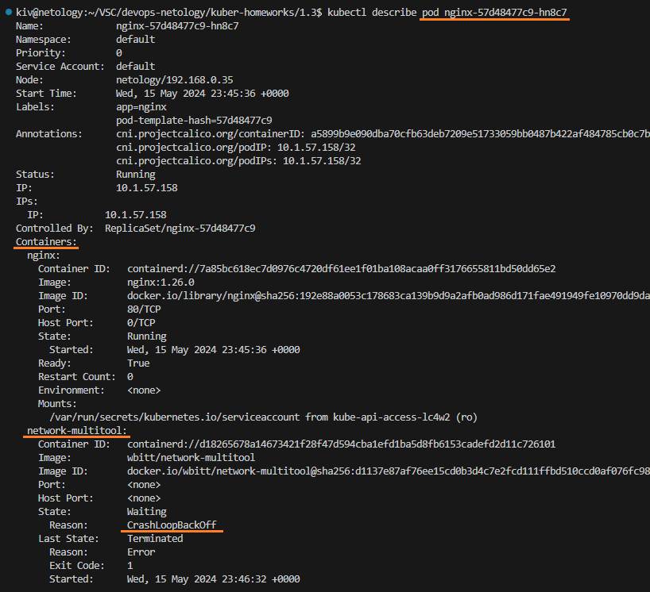
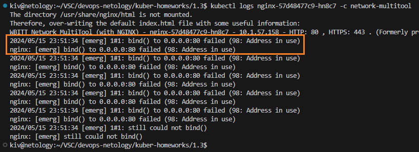
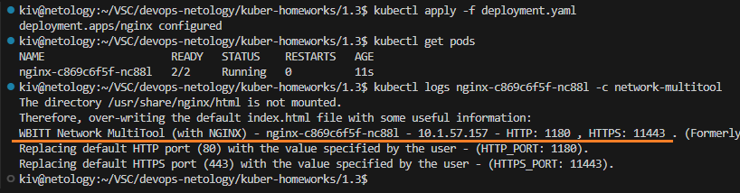
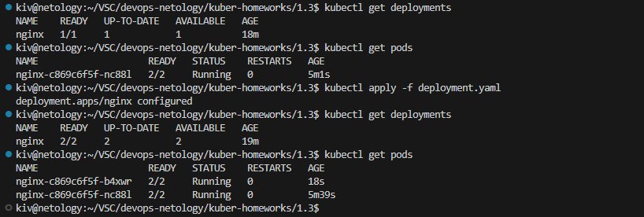
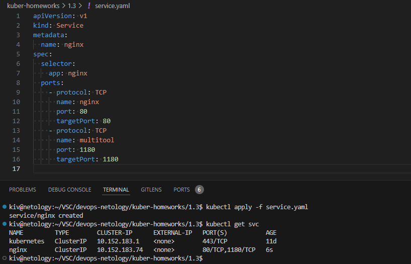
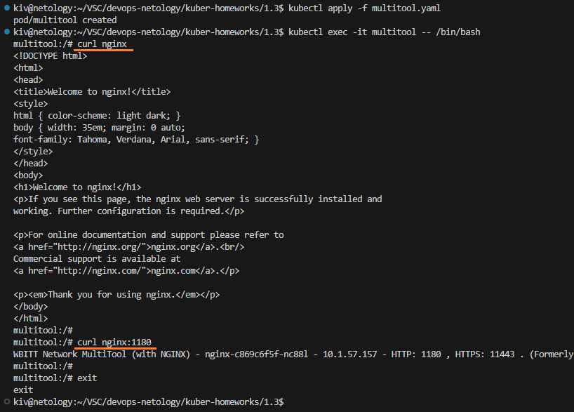

## Домашнее задание

https://github.com/netology-code/kuber-homeworks/blob/main/1.3/1.3.md


### Задание 1

Пробуем запустить deployment с подом из 2х контейнеров:

```
kubectl get deployments
kubectl get pods
kubectl apply -f deployment.yaml
kubectl get deployments
kubectl get pods
```



Видим ошибку. Определяем какой контейнер в поде не запустился:
```
kubectl describe pod nginx-57d48477c9-hn8c7
```



Посмотрим на логи проблемного контейнера:

```
kubectl logs nginx-57d48477c9-hn8c7 -c network-multitool
```



Из логов видно, что происходит ошибка запуска приложения на 80 порту. Внесем необходимые правки в манифест и применем его.

```
kubectl apply -f deployment.yaml
```



Под запустился, в логах контейнера мультитула также видно, что приложение успешно запущено.

Увеличиваем количество реплик в деплойменте до 2х:



Создадим и запустим сервис для доступа к двум контейнерам пода:

```
kubectl apply -f service.yaml
```



Сервис успешно запустился, пробуем открыть nginx и network-multitool контейнеры пода, запущенные через deployment, с отдельно созданного пода с multitool:

```
kubectl apply -f multitool.yaml
kubectl exec -it multitool -- /bin/bash
curl nginx
curl nginx:1180
```



Оба приложения доступны.
