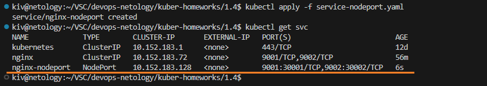

## Домашнее задание

https://github.com/netology-code/kuber-homeworks/blob/main/1.4/1.4.md

### Задание 1

- Поднимаем 3 реплики пода с двумя контейнерами nginx и multitool через deployment
- Усанавливаем сервис для доступа к приложениям
- Запускаем в отдельном поде multitool

```
kubectl get deployments
kubectl get pods
kubectl get svc
kubectl apply -f deployment.yaml
kubectl apply -f service.yaml
kubectl apply -f multitool.yaml
kubectl get deployments
kubectl get pods
kubectl get svc
```


Инфраструктура успешно развернута.

Пробуем открыть nginx и multitool:

```
kubectl exec -it multitool -- /bin/bash
curl nginx:9001
curl nginx:9002
```


Приложения успешно открываются.

Манифесты:
- [deployment](deployment.yaml)
- [service](service.yaml)

### Задание 2

Запускаем сервис в режиме NodePort:

```
kubectl apply -f service-nodeport.yaml
kubectl get svc
```



Сервис запущен, порты 30001, 30002 на ноде открыты. Т.к. используется локальный microk8s, то поэтому External-IP для сервиса не определен. Приложения будут доступны по данным портам на локальном ip с нодой кубера.

Определяем локальный ip ноды с кубером, используется подсеть 192.168.0.0/24:

```
ip addr show | grep 192.168
```


Проверяем локальную доступность приложений на портах 30001, 30002:


Приложения успешно открываются.

Идем на другой компьютер в данной локальной сети и пробуем подключиться с него:


Приложения успешно открываются.

Манифесты:
- [service-nodeport.yaml](service-nodeport.yaml)
