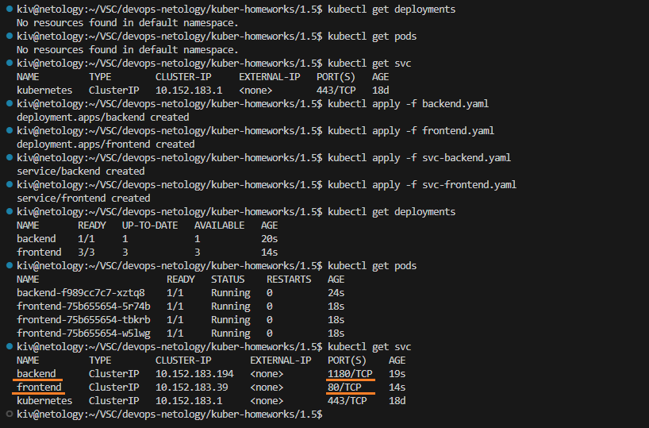

## Домашнее задание

https://github.com/netology-code/kuber-homeworks/blob/main/1.5/1.5.md

### Задание 1

Поднимаем frontend, backend и services

```
kubectl get deployments
kubectl get pods
kubectl get svc
kubectl apply -f backend.yaml
kubectl apply -f frontend.yaml
kubectl apply -f svc-backend.yaml
kubectl apply -f svc-frontend.yaml
kubectl get deployments
kubectl get pods
kubectl get svc
```



Инфраструктура успешно развернута.

Проверяем доступность backend с frontend

```
kubectl exec -it frontend-75b655654-5r74b -- /bin/bash
curl backend:1180
```


Проверяем доступность frontend с backend

```
kubectl exec -it backend-f989cc7c7-xztq8 -- /bin/bash
curl frontend
```


Приложения видят друг друга.

Манифесты:
- [backend.yaml](backend.yaml)
- [frontend.yaml](frontend.yaml)
- [svc-backend.yaml](svc-backend.yaml)
- [svc-frontend.yaml](svc-frontend.yaml)

### Задание 2

Посмотрим подключенные/доступные модули

```
microk8s status
```


Модуль Ingress отключен.

Включаем модуль Ingress

```
microk8s enable ingress
```


Посмотрим подключенные/доступные модули

```
microk8s status
```


Модуль Ingress включен.

Настраиваем Ingress

```
kubectl get ingress
kubectl apply -f ingress.yaml
kubectl get ingress
```


Ingress в Lens


Проверяем доступность приложений через Ingress с другого компьютера

```
На компьютере, с которого будем поключаться к приложениям, предварительно необходимо добавить в /etc/hosts запись вида:
192.168.0.35 example.local

где 192.168.0.35 адрес Ingress
```


Приложения успешно открываются.

Манифесты:
- [ingress.yaml](ingress.yaml)
