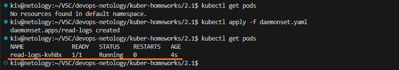
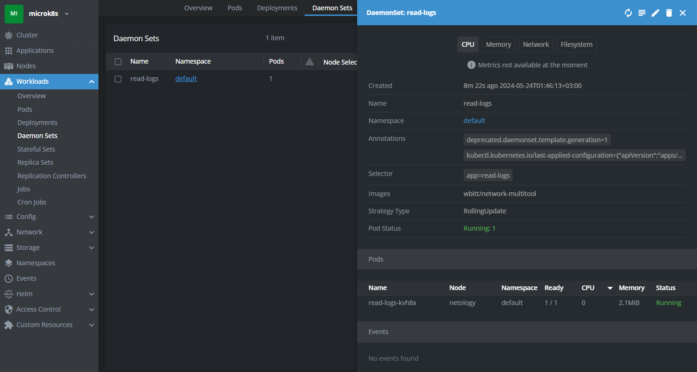
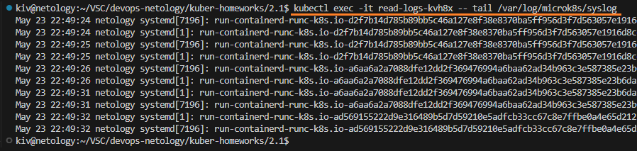

## Домашнее задание

https://github.com/netology-code/kuber-homeworks/blob/main/2.1/2.1.md

### Задание 1

Поднимаем deployment с подом и двумя контейнерами busybox и multitool

```
kubectl get deployments
kubectl get pods
kubectl apply -f deployment.yaml
kubectl get deployments
kubectl get pods
```


Подключимся к контейнеру multitool и посмотрим на файл /netology/file.txt

```
Контейнер busybox пишет в данный файл текущее дату/время раз в 5 секунд
```

```
kubectl exec -it kuber-2-1-5f7ff5dd6b-7twk6 -c multitool -- sh
tail /netology/file.txt
```


Видим, что в файл добавлены запси дата/время раз в 5 секунд.

Манифесты:
- [deployment.yaml](deployment.yaml)


### Задание 2

Поднимаем daemonset с multitool для чтения логов с кластера microk8s

```
kubectl get pods
kubectl apply -f daemonset.yaml
kubectl get pods
```



Daemonset в Lens



Читаем syslog с кластера кубера через pod daemonset'a
```
kubectl exec -it read-logs-kvh8x -- tail /var/log/microk8s/syslog
```



Манифесты:
- [daemonset.yaml](daemonset.yaml)
