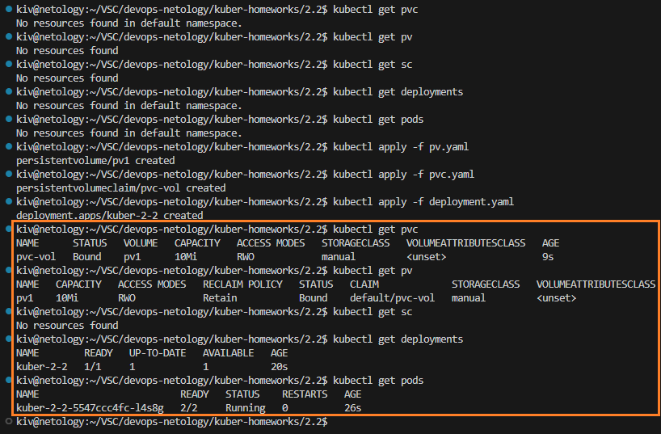
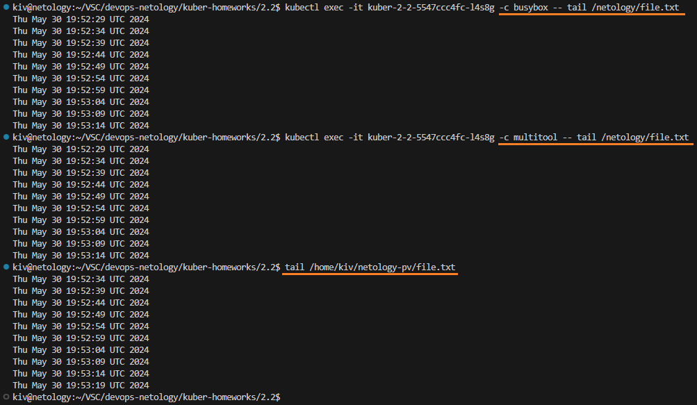
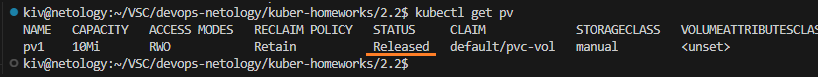
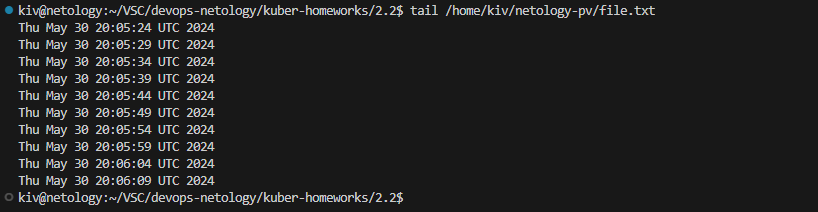
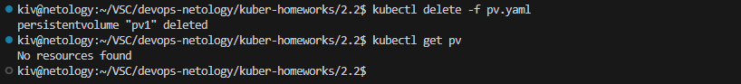

## Домашнее задание

https://github.com/netology-code/kuber-homeworks/blob/main/2.2/2.2.md

### Задание 1

Поднимаем deployment с подом и двумя контейнерами busybox и multitool

```
kubectl get pvc
kubectl get pv
kubectl get sc
kubectl get deployments
kubectl get pods
kubectl apply -f pv.yaml
kubectl apply -f pvc.yaml
kubectl apply -f deployment.yaml
kubectl get pvc
kubectl get pv
kubectl get sc
kubectl get deployments
kubectl get pods
```



Смотрим, что контейнер busybox наполняет файл /netology/file.txt данными. При этом эти данные доступны в контейнере multotool и на ноде кластера K8s.

```
kubectl exec -it kuber-2-2-5547ccc4fc-l4s8g -c busybox -- tail /netology/file.txt
kubectl exec -it kuber-2-2-5547ccc4fc-l4s8g -c multitool -- tail /netology/file.txt
tail /home/kiv/netology-pv/file.txt
```




Удалим deployment и pvc

```
kubectl delete -f deployment.yaml
kubectl delete -f pvc.yaml
kubectl get deployments
kubectl get pods
kubectl get pvc
kubectl get pv
```



Мы видим статус Released. Это состояние означает, что PVC, который использовал данный PV, был удален. Тем не менее, PV не был очищен и готов к повторному использованию. Данные все еще существуют на PV. Для очистки и удаления PV требуется участие администратора. 

Это произошло потому, что мы явно не задали PersistentVolumeReclaimPolicy в PV. В данном случае используется значение по умолчанию равное Retain, которое как раз определяет текущее поведение.

Файл с данными все еще сохраняется на локальном диске ноды кластера K8s.

```
tail /home/kiv/netology-pv/file.txt
```



Удалим PV

```
kubectl delete -f pv.yaml
kubectl get pv
```



Проверим файл с данными на ноде кластера K8s

```
tail /home/kiv/netology-pv/file.txt
```


Файл остался, т.к. при создании PV не была явно задана PersistentVolumeReclaimPolicy, в таком случае она выставляется в Retain, что определяет такое поведение.

Данные PV на ноде кластера надо удалять вручную

```
sudo rm -r /home/kiv/netology-pv
```

Манифесты:
- [deployment.yaml](deployment.yaml)
- [pvc.yaml](pvc.yaml)
- [pv.yaml](pv.yaml)
