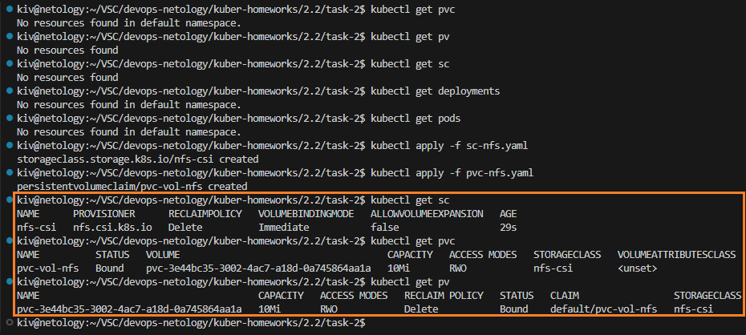
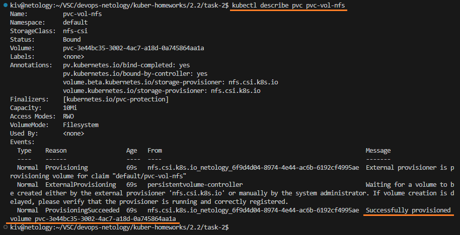
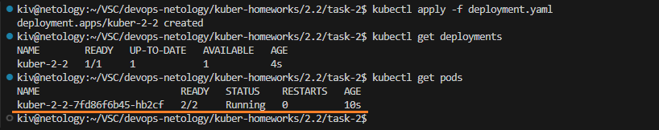
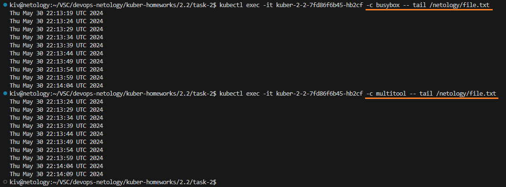
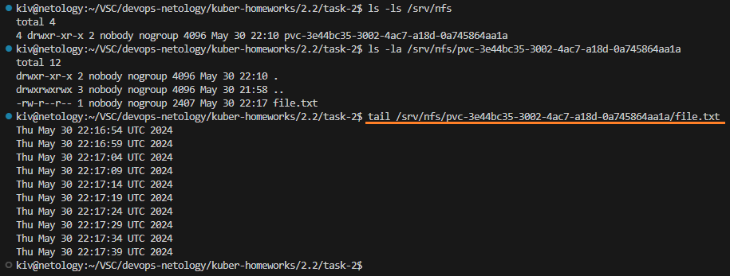

## Домашнее задание

https://github.com/netology-code/kuber-homeworks/blob/main/2.2/2.2.md

### Задание 1

Поднимаем deployment с подом и двумя контейнерами busybox и multitool

```
kubectl get pvc
kubectl get pv
kubectl get sc
kubectl get deployments
kubectl get pods
kubectl apply -f pv.yaml
kubectl apply -f pvc.yaml
kubectl apply -f deployment.yaml
kubectl get pvc
kubectl get pv
kubectl get sc
kubectl get deployments
kubectl get pods
```


Смотрим, что контейнер busybox наполняет файл /netology/file.txt данными. При этом эти данные доступны в контейнере multitool и на ноде кластера K8s.

```
kubectl exec -it kuber-2-2-5547ccc4fc-l4s8g -c busybox -- tail /netology/file.txt
kubectl exec -it kuber-2-2-5547ccc4fc-l4s8g -c multitool -- tail /netology/file.txt
tail /home/kiv/netology-pv/file.txt
```


Удалим deployment и pvc

```
kubectl delete -f deployment.yaml
kubectl delete -f pvc.yaml
kubectl get deployments
kubectl get pods
kubectl get pvc
kubectl get pv
```


Мы видим статус Released. Это состояние означает, что PVC, который использовал данный PV, был удален. Тем не менее, PV не был очищен и готов к повторному использованию. Данные все еще существуют на PV. Для очистки и удаления PV требуется участие администратора. 

Это произошло потому, что мы явно не задали PersistentVolumeReclaimPolicy в PV. В данном случае используется значение по умолчанию равное Retain, которое как раз определяет текущее поведение.

Файл с данными все еще сохраняется на локальном диске ноды кластера K8s.

```
tail /home/kiv/netology-pv/file.txt
```


Удалим PV

```
kubectl delete -f pv.yaml
kubectl get pv
```


Проверим файл с данными на ноде кластера K8s

```
tail /home/kiv/netology-pv/file.txt
```


Файл остался, т.к. при создании PV не была явно задана PersistentVolumeReclaimPolicy, в таком случае она выставляется в Retain, что определяет такое поведение.

Данные PV на ноде кластера надо удалять вручную

```
sudo rm -r /home/kiv/netology-pv
```

Манифесты:
- [pv.yaml](task-1/pv.yaml)
- [pvc.yaml](task-1/pvc.yaml)
- [deployment.yaml](task-1/deployment.yaml)

### Задание 2

Настраиваем nfs server по данной инструкции: \
https://microk8s.io/docs/how-to-nfs

Настраиваем SC и PVC

```
kubectl get pvc
kubectl get pv
kubectl get sc
kubectl get deployments
kubectl get pods
kubectl apply -f sc-nfs.yaml
kubectl apply -f pvc-nfs.yaml
kubectl get sc
kubectl get pvc
kubectl get pv
```



```
kubectl describe pvc pvc-vol-nfs
```



Видим, что PV сформировался автоматически.

Для наглядности поднимем deployment с подом и двумя контейнерами busybox и multitool из предыдущего задания, подключенными к nfs.

```
kubectl apply -f deployment.yaml
kubectl get deployments
kubectl get pods
```



Смотрим, что контейнер busybox наполняет файл /netology/file.txt данными. При этом эти данные доступны в контейнере multitool.

```
kubectl exec -it kuber-2-2-7fd86f6b45-hb2cf -c busybox -- tail /netology/file.txt
kubectl exec -it kuber-2-2-7fd86f6b45-hb2cf -c multitool -- tail /netology/file.txt
```



Файл с данными расположен на нашем nfs сервере

```
ls -ls /srv/nfs
ls -la /srv/nfs/pvc-3e44bc35-3002-4ac7-a18d-0a745864aa1a
tail /srv/nfs/pvc-3e44bc35-3002-4ac7-a18d-0a745864aa1a/file.txt
```



Манифесты:
- [sc-nfs.yaml](task-2/sc-nfs.yaml)
- [pvc-nfs.yaml](task-2/pvc-nfs.yaml)
- [deployment.yaml](task-2/deployment.yaml)
