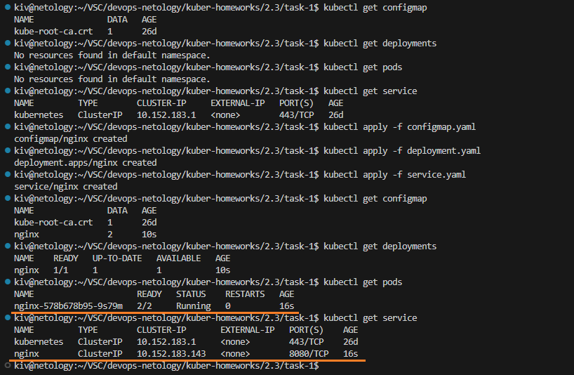
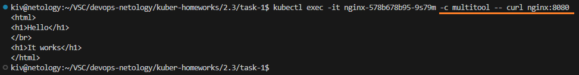
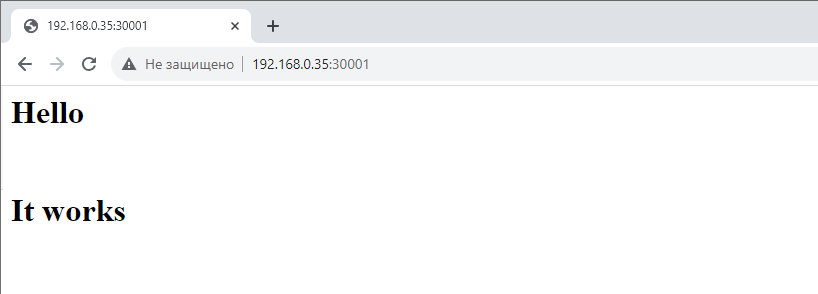
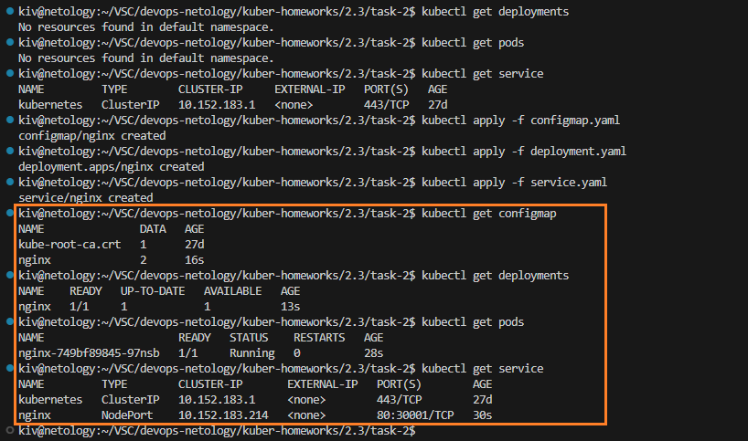
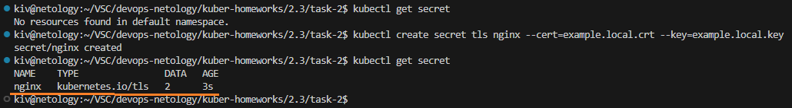
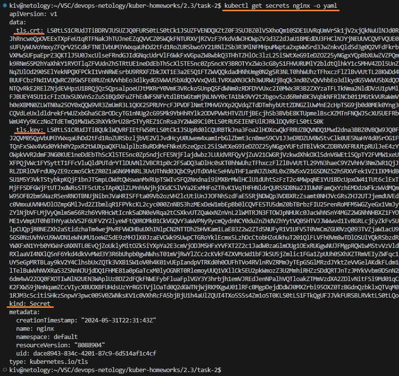
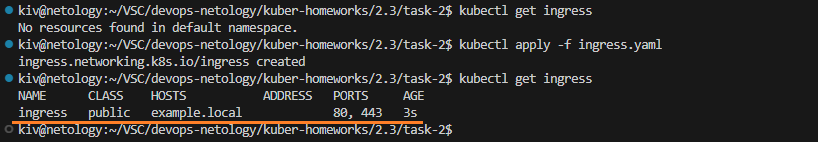
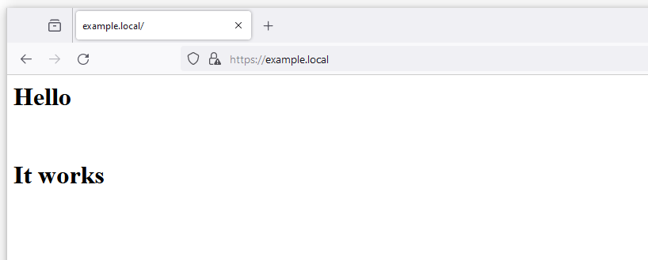

## Домашнее задание

https://github.com/netology-code/kuber-homeworks/blob/main/2.3/2.3.md

### Задание 1

Поднимаем configmap, deployment с подом c двумя контейнерами nginx и multitool, также запускаем service

```
kubectl get configmap
kubectl get deployments
kubectl get pods
kubectl get service
kubectl apply -f configmap.yaml
kubectl apply -f deployment.yaml
kubectl apply -f service.yaml
kubectl get configmap
kubectl get deployments
kubectl get pods
kubectl get service
```



Контейнеры и сервис успешно запустились.

Пробуем открыть nginx через контейнер c multitool

```
kubectl exec -it nginx-578b678b95-9s79m -c multitool -- curl nginx:8080
```



Пробуем открыть nginx с другого компьютера



Страница успешно открывается в обоих случаях.

Манифесты:
- [configmap.yaml](task-1/configmap.yaml)
- [deployment.yaml](task-1/deployment.yaml)
- [service.yaml](task-1/service.yaml)

### Задание 2

Поднимаем configmap, deployment с nginx, также запускаем service

```
kubectl get configmap
kubectl get deployments
kubectl get pods
kubectl get service
kubectl apply -f configmap.yaml
kubectl apply -f deployment.yaml
kubectl apply -f service.yaml
kubectl get configmap
kubectl get deployments
kubectl get pods
kubectl get service
```



Формируем самоподписанный сертификат для домена example.local

```
openssl req -x509 -nodes -days 365 -newkey rsa:4096 -keyout example.local.key -out example.local.crt -subj "/CN=example.local"
```

В текущей папке у нас появляется два файла:
- example.local.key - приватный ключ
- example.local.crt - самоподписанный сертификат

Создаем TLS-секрет на базе созданного приватного ключа и самоподписанного сертификата

```
kubectl get secret
kubectl create secret tls nginx --cert=example.local.crt --key=example.local.key
kubectl get secret
```



Видим, что секрет создался.

Проверить его можно с помощью следующей команды
```
kubectl get secrets nginx -o yaml
```



Создаем Ingress

```
kubectl get ingress
kubectl apply -f ingress.yaml
kubectl get ingress
```



Пробуем открыть страницу по https с помощью curl


Пробуем открыть страницу по https с помощью Firefox



В обоих случаях страница успешно открывается.

Манифесты:
- [configmap.yaml](task-2/configmap.yaml)
- [deployment.yaml](task-2/deployment.yaml)
- [service.yaml](task-2/service.yaml)
- [ingress.yaml](task-2/ingress.yaml)
