## Домашнее задание

https://github.com/netology-code/kuber-homeworks/blob/main/2.4/2.4.md

### Задание 1

Проверяем включен ли RBAC (Role-Based Access Control) в нашем кластере microk8s:
```
microk8s status --wait-ready
```

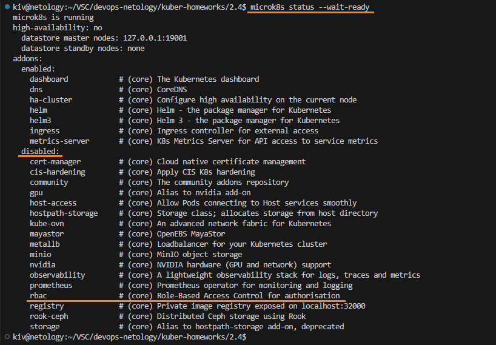

Видим, что RBAC выключен.

Включаем RBAC (Role-Based Access Control) в нашем кластере microk8s:
```
microk8s enable rbac
microk8s status --wait-ready
```

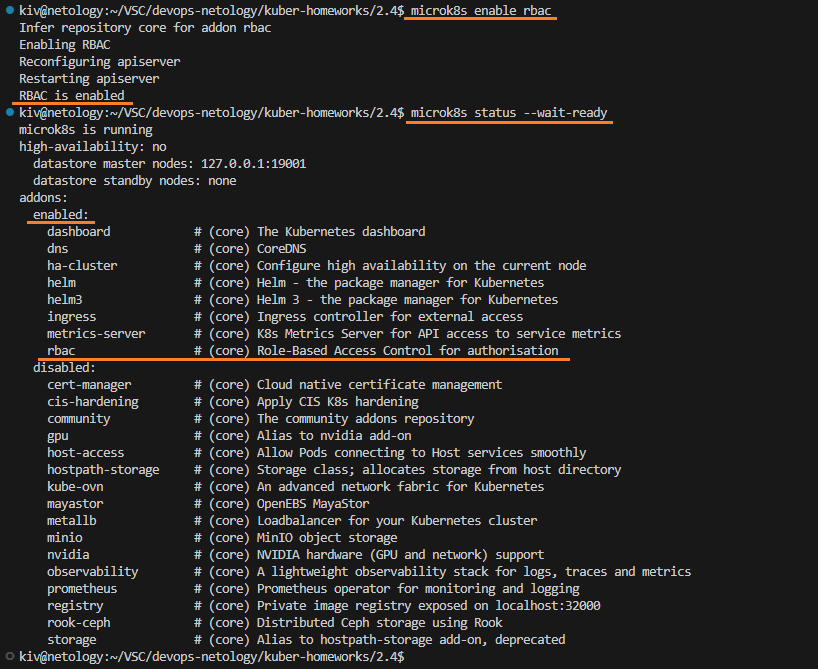

RBAC успешно включен.

Посмотрим, какие корневые сертификаты с именем ca.crt, относящиеся к microk8s есть в системе:
```
find / -name ca.crt 2>/dev/null | grep microk8s
```
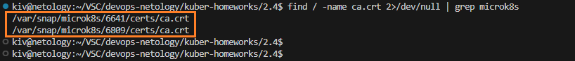

Есть два разных сертификата.

Определим, какая версия microk8s в данный момент активна и используется в системе:
```
snap list microk8s
```

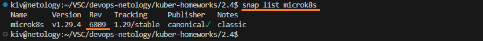

Используется версия 6809, значит корневой сертификат находится по следующему пути:
```
/var/snap/microk8s/6809/certs/ca.crt
```

Создадим ключ и запрос на сертификат (CSR):
```
mkdir certs && cd certs
openssl genrsa -out user-netology-2-4.key 2048

openssl req -new \
-key user-netology-2-4.key \
-out user-netology-2-4.csr \
-subj "/CN=user-netology-2-4/O=netology"

ls -la
```

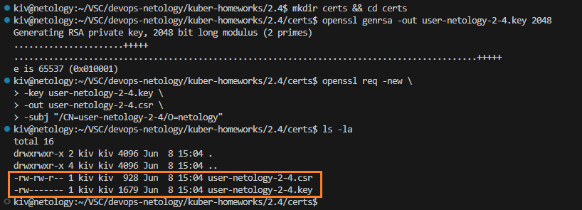

Подпишем запрос с помощью CA:
```
openssl x509 -req \
-in user-netology-2-4.csr \
-out user-netology-2-4.crt \
-CA /var/snap/microk8s/6809/certs/ca.crt \
-CAkey /var/snap/microk8s/6809/certs/ca.key \
-CAcreateserial \
-days 365

ls -la
```

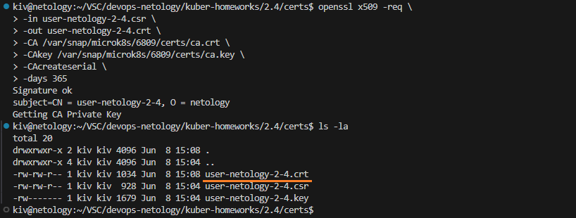

Новый публичный ключ для пользователя user-netology-2-4 сформирован.


Настроим конфигурационный файл kubectl для подключения нового пользователя

Текущие контексты:
```
kubectl config get-contexts
```

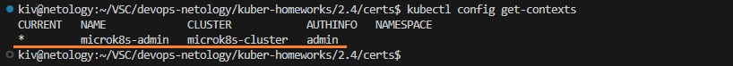

Добавим нового пользователя в конфиг:
```
kubectl config set-credentials user-netology-2-4 \
--client-certificate=/var/snap/microk8s/6809/certs/user-netology-2-4.crt \
--client-key=/var/snap/microk8s/6809/certs/user-netology-2-4.key \
--embed-certs=true
```

Добавим в конфиг новый контекст, привязанный к новому пользователю:
```
kubectl config set-context microk8s-netology-2-4 \
--cluster=microk8s-cluster \
--user=user-netology-2-4
```

Посмотрим на текущий конфиг файл:
```
kubectl config view
```

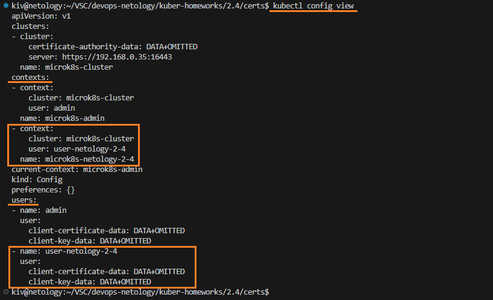

Новый пользователь и контекст успешно добавлены.

Изменения внеслись в данный файл:
```
~/.kube/config
```

Посмотрим текущие контексты:
```
kubectl config get-contexts
```

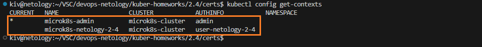

Переключимся на контекст, привязанный к новому пользователю:
```
kubectl config use-context microk8s-netology-2-4
kubectl config get-contexts
```

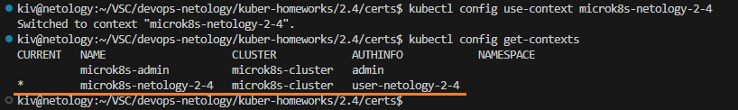

Попробуем получить список подов:
```
kubectl get pods
```

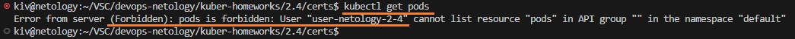

На данный момент для пользователя не настроен RBAC и у него нет прав на доступ к подам.

Подключимся под администратором и добавим роли для нового пользователя.

Сменим контекст подключения на админский:
```
kubectl config get-contexts
kubectl config use-context microk8s-admin
```

Посмотрим на текущие роли:
```
kubectl describe roles.rbac.authorization.k8s.io
```

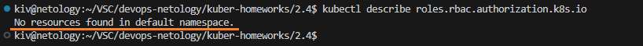

Пока роли не определены.

Применим Role, RoleBinding для нового пользователя и посмотрим добавилась ли роль.
```
kubectl apply -f role.yaml
kubectl apply -f role_binding.yaml
kubectl describe roles.rbac.authorization.k8s.io
kubectl get rolebindings
```

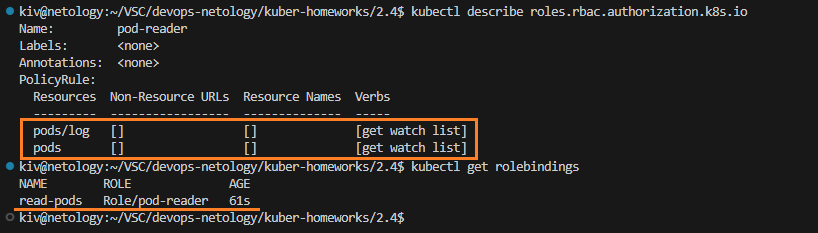

Role и RoleBinding успешно добавились.

Сменим контекст на нового пользователя
```
kubectl config get-contexts
kubectl config use-context microk8s-netology-2-4
```

Попробуем выполнить разные команды на кластере под новым пользователем:
```
kubectl get pods
kubectl describe pod nginx-749bf89845-97nsb | grep Name
kubectl logs nginx-749bf89845-97nsb
kubectl get nodes
```

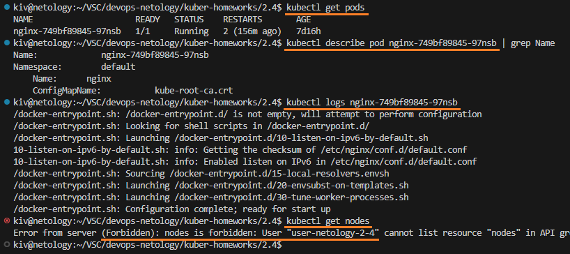

Мы смогли прочитать список подов, посмотреть подробную информацию о поде, также смогли посмотреть логи пода. При этом доступ к нодам у нас закрыт. Т.е. текущие права пользователя соответствуют тем настройкам, которые мы для него задали в роли.

При необходимости можно удалить информацию из конфига о данном пользователе и его контексте:
```
kubectl config unset users.user-netology-2-4
kubectl config unset contexts.microk8s-netology-2-4
```

Манифесты:
- [role.yaml](role.yaml)
- [role_binding.yaml](role_binding.yaml)
