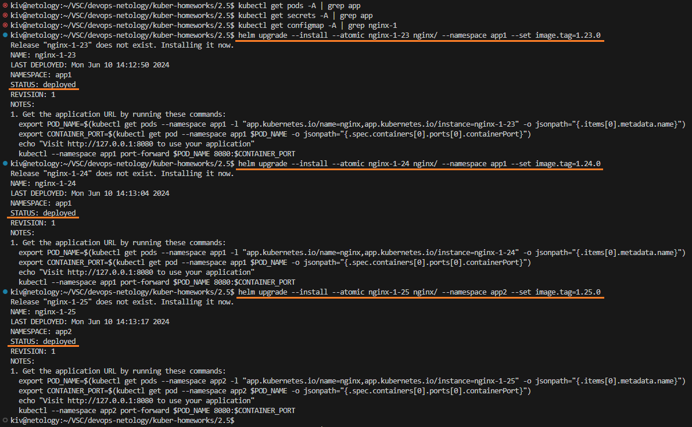

## Домашнее задание

https://github.com/netology-code/kuber-homeworks/blob/main/2.5/2.5.md

### Задание 1


Устанавливаем Helm:
```
curl -fsSL https://raw.githubusercontent.com/helm/helm/main/scripts/get-helm-3 | bash
helm version
```


Helm успешно установлен, но есть предупреждения по разрешениям на конфиг кластера.

Исправляем права:
```
chmod 600 ~/.kube/config
helm version
```


Создаем Helm chart:
```
helm create nginx
```

Удаляем часть данных из только что созданного шаблонного чарта:
```
rm -R nginx/charts
rm nginx/.helmignore
```

Создаем два неймспейса app1 и app2:
```
kubectl get ns | grep app
kubectl create namespace app1
kubectl create namespace app2
kubectl get ns | grep app
```


Проверяем Helm chart перед установкой:
<details>
    <summary>helm template nginx</summary>

```yaml
kiv@netology:~/VSC/devops-netology/kuber-homeworks/2.5$ helm template nginx
---
# Source: nginx/templates/serviceaccount.yaml
apiVersion: v1
kind: ServiceAccount
metadata:
name: release-name-nginx
labels:
    helm.sh/chart: nginx-0.1.0
    app.kubernetes.io/name: nginx
    app.kubernetes.io/instance: release-name
    app.kubernetes.io/version: "1.23.0"
    app.kubernetes.io/managed-by: Helm
automountServiceAccountToken: true
---
# Source: nginx/templates/configmap.yaml
apiVersion: v1
kind: ConfigMap
metadata:
name: "nginx-1,14,0"
data:
nginx.conf: |
    worker_processes 1;

    events {
        worker_connections 1024;
    }

    http {
        server {
            listen 80;
            server_name localhost;

            location / {
                root /usr/share/nginx/html;
                index index.html;
            }
        }
    }
index.html: |
    <html>
    <h1>Hello</h1>
    </br>
    <h1>It works</h1>
    </html>
---
# Source: nginx/templates/service.yaml
apiVersion: v1
kind: Service
metadata:
name: release-name-nginx
labels:
    helm.sh/chart: nginx-0.1.0
    app.kubernetes.io/name: nginx
    app.kubernetes.io/instance: release-name
    app.kubernetes.io/version: "1.23.0"
    app.kubernetes.io/managed-by: Helm
spec:
type: ClusterIP
ports:
    - port: 80
    targetPort: http
    protocol: TCP
    name: http
selector:
    app.kubernetes.io/name: nginx
    app.kubernetes.io/instance: release-name
---
# Source: nginx/templates/deployment.yaml
apiVersion: apps/v1
kind: Deployment
metadata:
name: release-name-nginx
labels:
    helm.sh/chart: nginx-0.1.0
    app.kubernetes.io/name: nginx
    app.kubernetes.io/instance: release-name
    app.kubernetes.io/version: "1.23.0"
    app.kubernetes.io/managed-by: Helm
spec:
replicas: 1
selector:
    matchLabels:
    app.kubernetes.io/name: nginx
    app.kubernetes.io/instance: release-name
template:
    metadata:
    labels:
        helm.sh/chart: nginx-0.1.0
        app.kubernetes.io/name: nginx
        app.kubernetes.io/instance: release-name
        app.kubernetes.io/version: "1.23.0"
        app.kubernetes.io/managed-by: Helm
    spec:
    serviceAccountName: release-name-nginx
    securityContext:
        {}
    containers:
        - name: nginx
        securityContext:
            {}
        image: "nginx:1,14,0"
        imagePullPolicy: IfNotPresent
        ports:
            - name: http
            containerPort: 80
            protocol: TCP
        livenessProbe:
            httpGet:
            path: /
            port: http
        readinessProbe:
            httpGet:
            path: /
            port: http
        resources:
            {}
        volumeMounts:
            - mountPath: /etc/nginx/nginx.conf
            name: nginx-conf
            subPath: nginx.conf
            - mountPath: /usr/share/nginx/html/index.html
            name: nginx-conf
            subPath: index.html
    volumes:
        - name: nginx-conf
        configMap:
            name: "nginx-1,14,0"
---
# Source: nginx/templates/tests/test-connection.yaml
apiVersion: v1
kind: Pod
metadata:
name: "release-name-nginx-test-connection"
labels:
    helm.sh/chart: nginx-0.1.0
    app.kubernetes.io/name: nginx
    app.kubernetes.io/instance: release-name
    app.kubernetes.io/version: "1.23.0"
    app.kubernetes.io/managed-by: Helm
annotations:
    "helm.sh/hook": test
spec:
containers:
    - name: wget
    image: busybox
    command: ['wget']
    args: ['release-name-nginx:80']
restartPolicy: Never
```
</details>

С помощью helm деплоим две версии nginx в неймспейс app1 и одну в неймспейс app2:
```
kubectl get pods -A | grep app
kubectl get secrets -A | grep app
kubectl get configmap -A | grep nginx-1
helm upgrade --install --atomic nginx-1-23 nginx/ --namespace app1 --set image.tag=1.23.0
helm upgrade --install --atomic nginx-1-24 nginx/ --namespace app1 --set image.tag=1.24.0
helm upgrade --install --atomic nginx-1-25 nginx/ --namespace app2 --set image.tag=1.25.0
```



Проверяем результат:
```
kubectl get pods -A | grep app
kubectl get secrets -A | grep app
kubectl get configmap -A | grep nginx-1
kubectl get service -A | grep app
kubectl describe pod nginx-1-23-5bcb8d96b8-fhnsn -n app1 | grep Image:
kubectl describe pod nginx-1-24-7b885b898f-9q2sg -n app1 | grep Image:
kubectl describe pod nginx-1-25-8584bbc84b-r4xlv -n app2 | grep Image:
```


Приложения успешно запущены.

Helm chart:
- [nginx](nginx)
