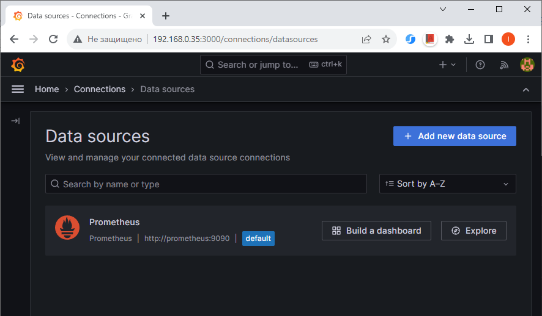
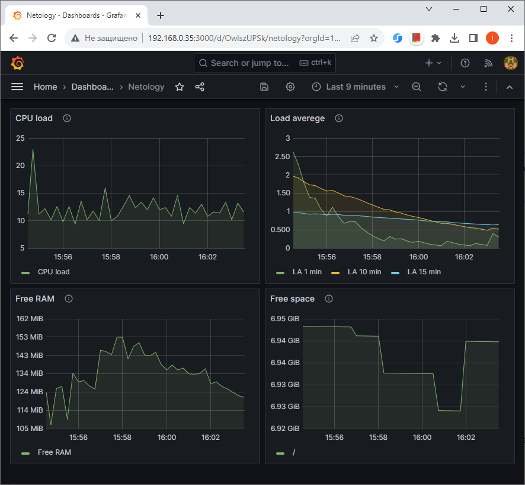
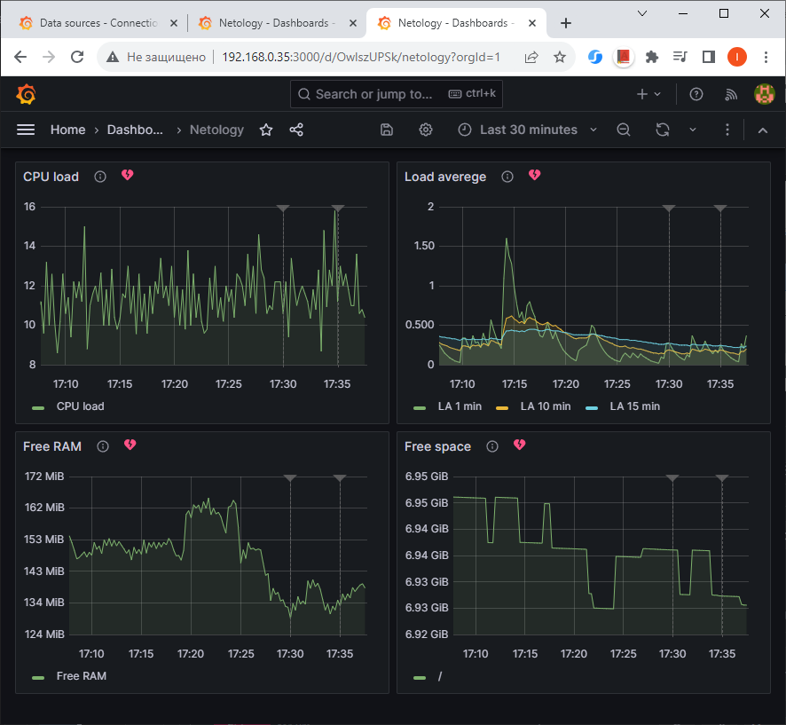
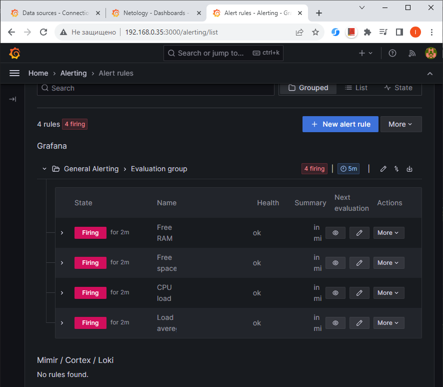
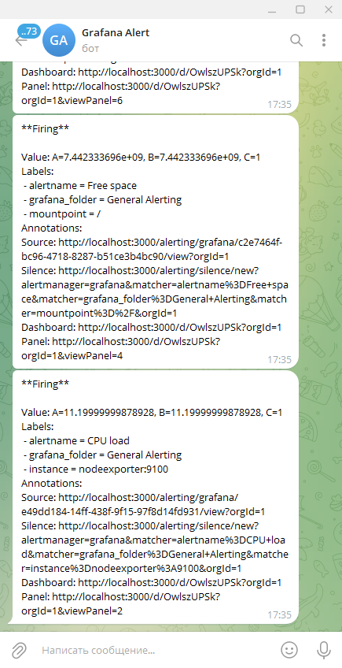

## Домашнее задание

https://github.com/netology-code/mnt-homeworks/blob/MNT-video/10-monitoring-03-grafana/README.md

### Задание 1

Prometheus подключен как источник данных в Grafana



### Задание 2

Утилизация CPU
```
100 - (avg by(instance) (irate(node_cpu_seconds_total{mode="idle"}[$__rate_interval])) * 100)
```

Load averege
```
node_load1{instance="nodeexporter:9100"}
node_load5{instance="nodeexporter:9100"}
node_load15{instance="nodeexporter:9100"}
```

Количество свободной оперативной памяти
```
node_memory_MemFree_bytes{instance="nodeexporter:9100"}
```

Количество места на файловой системе
```
sum by(mountpoint) (node_filesystem_avail_bytes{mountpoint=~"/"})
```



### Задание 3

Dashboard с настроенными алертами





Видим, что алерты сработали.

Также пришли сообщения в Telegram



### Задание 4

Dashboard
- [dashboard.json](dashboard.json)
