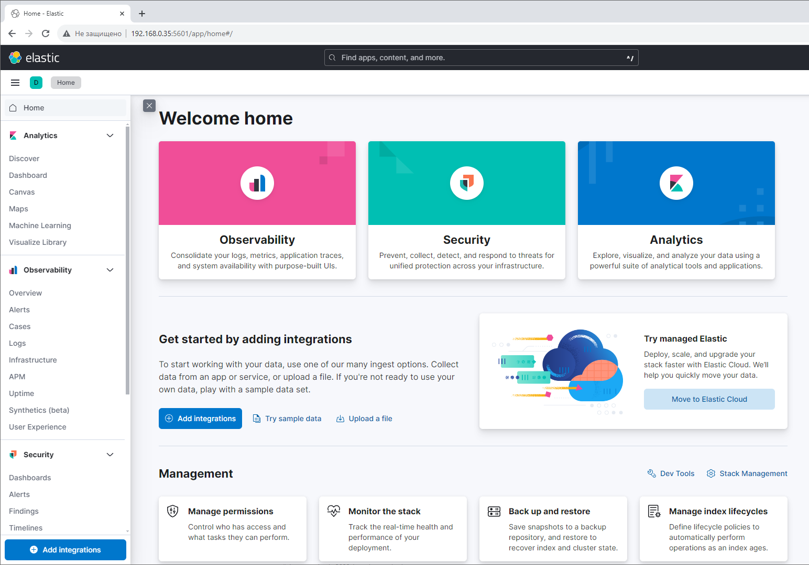
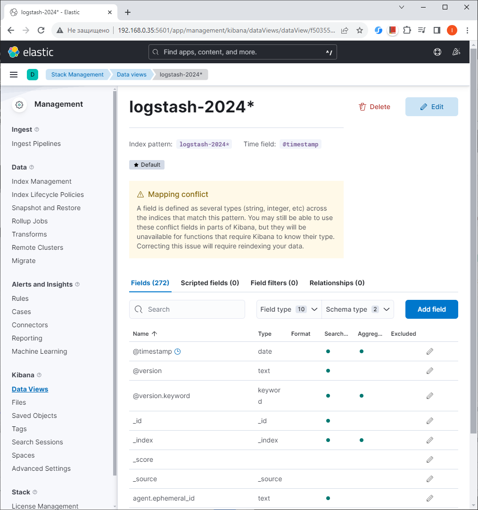

## Домашнее задание

https://github.com/netology-code/mnt-homeworks/tree/MNT-video/10-monitoring-04-elk

### Задание 1

docker ps


Интерфейс Kibana



### Задание 2

Созданные index-patterns

```
Menu - Management - Stack Management - Kibana - Data Views 
```


При переходе в индекс мы видим все поля, которые в нем присутствуют


 
Просмотр логов в Kibana 

```
Menu - Analitics - Discover
```


