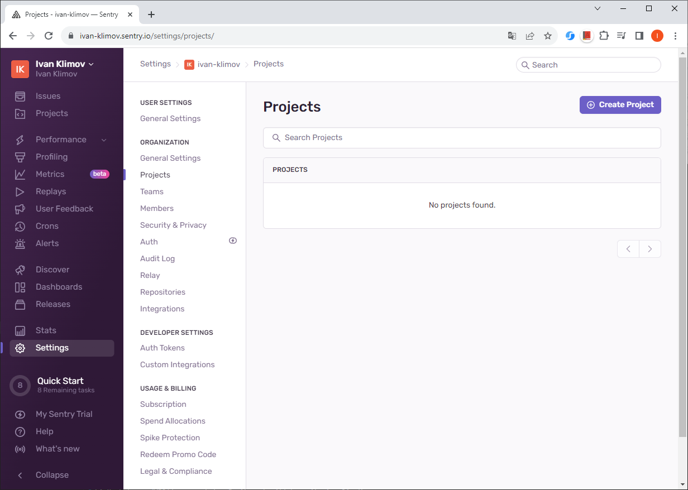
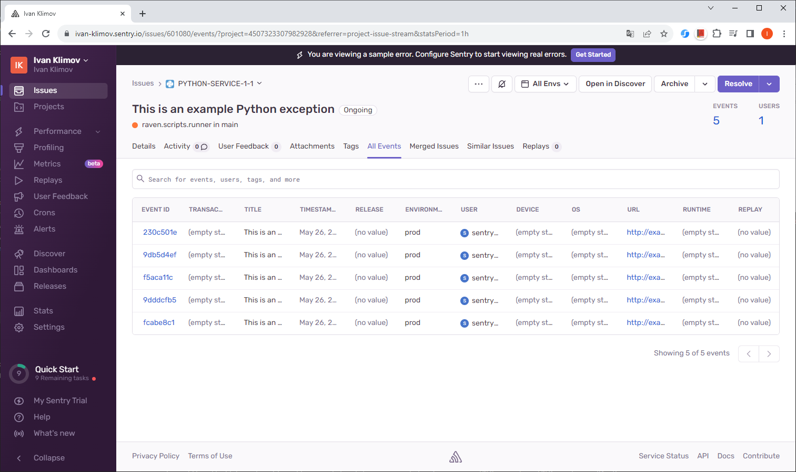
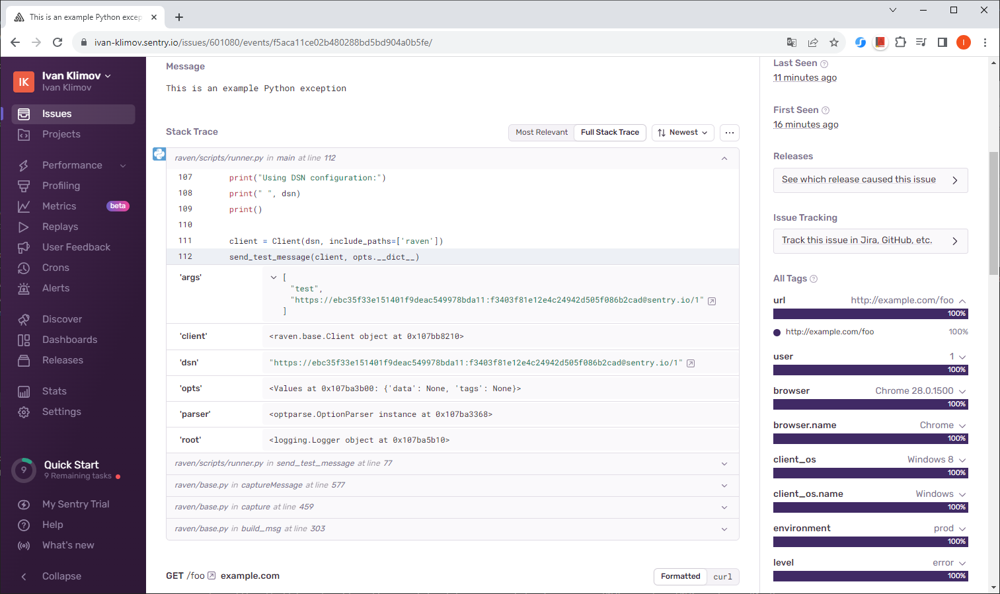
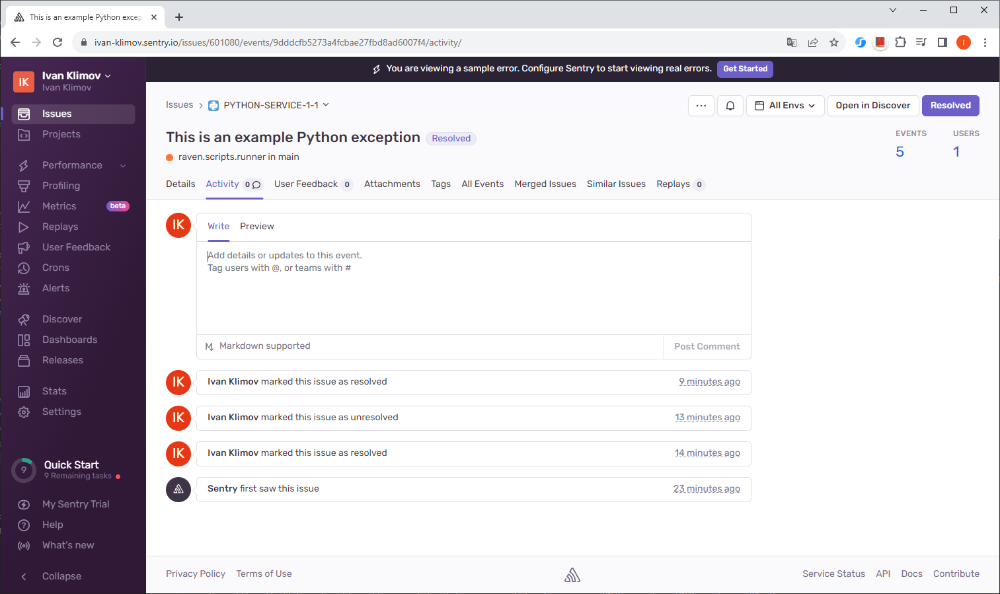
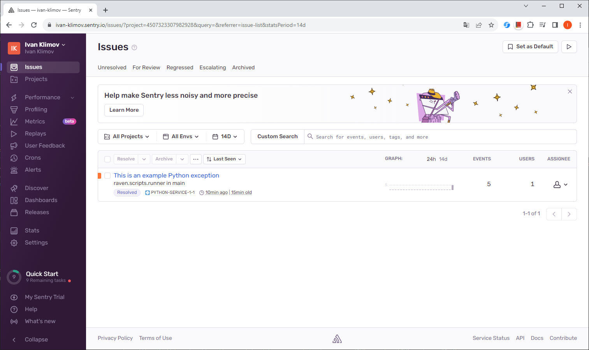
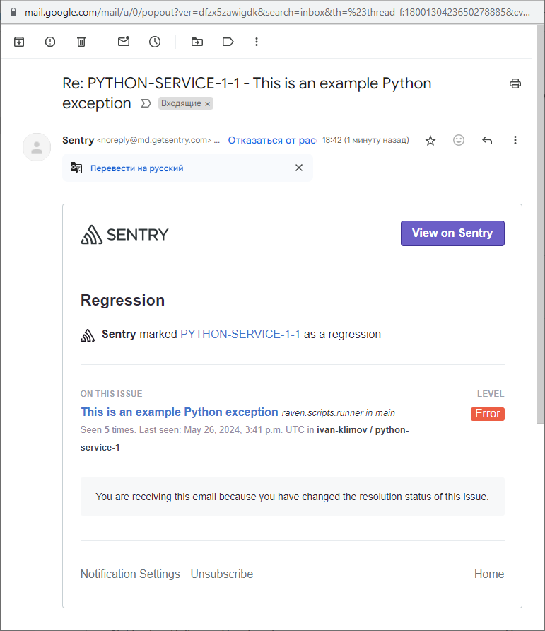

## Домашнее задание

https://github.com/netology-code/mnt-homeworks/blob/MNT-video/10-monitoring-05-sentry/README.md

### Задание 1

Создан бесплатный Free Сloud account в sentry.io

### Задание 2

Список событий Issue

Stack trace из события

Issue помечено как Resolved

### Задание 3

Оповещение на почте

