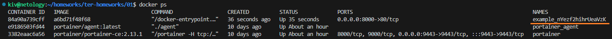
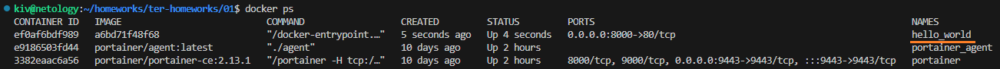
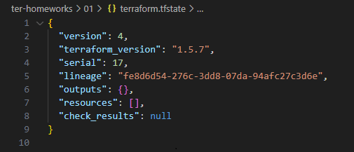
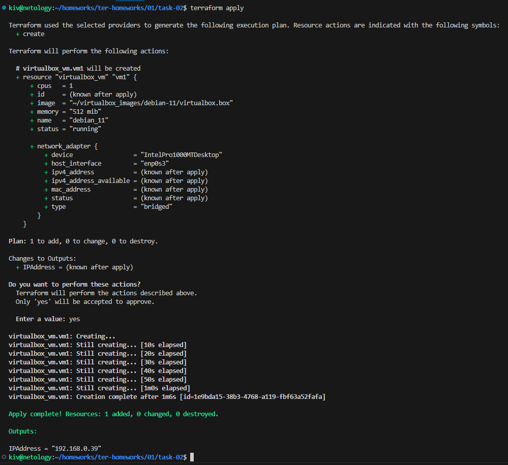
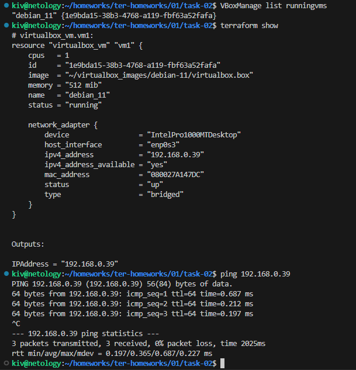

## Задача 1

#### 2. Изучите файл **.gitignore**. В каком terraform-файле, согласно этому .gitignore, допустимо сохранить личную, секретную информацию?

Личная, секретная информация может быть сохранена в файле personal.auto.tfvars. Этот файл не включается в систему контроля версий Git, так как он явно указан в .gitignore.

#### 3. Выполните код проекта. Найдите в state-файле секретное содержимое созданного ресурса random_password, пришлите в качестве ответа конкретный ключ и его значение.

```
terraform init
terraform apply
```

В terraform.tfstate создастся ресурс random_password.random_string, там смотрим поле:
```
"result": "nYezf2hihrUeaVzK"
```

#### 4. Раскомментируйте блок кода, примерно расположенный на строчках 29–42 файла main.tf. Выполните команду terraform validate. Объясните, в чём заключаются намеренно допущенные ошибки. Исправьте их.

```
Error: Missing name for resource
All resource blocks must have 2 labels (type, name).
При создании ресурса необходимо добавить имя (уникальное имя ресурса)
```

```
Error: Invalid resource name
A name must start with a letter or underscore and may contain only letters, digits, underscores, and dashes.
Имя ресурса не может начинаться с цифры, как в нашем примере
```

```
Error: Reference to undeclared resource
A managed resource "random_password" "random_string_FAKE" has not been declared in the root module.
Не найден ресурс с именем random_string_FAKE
```

```
Error: Unsupported attribute
This object has no argument, nested block, or exported attribute named "resulT". Did you mean "result"?
Неверное имя атрибута ресурса
```

#### 5. Выполните код. В качестве ответа приложите: исправленный фрагмент кода и вывод команды docker ps.

Исправленный [main.cf](main.tf) *(с учетом правок последующих заданий)*

```
terraform apply
```

docker ps



#### 6. Замените имя docker-контейнера в блоке кода на hello_world. Не перепутайте имя контейнера и имя образа. Мы всё ещё продолжаем использовать name = "nginx:latest". Выполните команду terraform apply -auto-approve. Объясните своими словами, в чём может быть опасность применения ключа -auto-approve. Догадайтесь или нагуглите зачем может пригодиться данный ключ? В качестве ответа дополнительно приложите вывод команды docker ps.

Ключ -auto-approve в команде terraform apply используется для автоматического подтверждения применения изменений без необходимости интерактивного взаимодействия пользователя. Это может быть полезным в автоматизированных сценариях, скриптах, или других ситуациях, когда не требуется человеческого вмешательства.

Однако, следует быть осторожным при использовании -auto-approve, поскольку это может привести к следующим проблемам:

- **Нежелательные изменения:** Автоматическое подтверждение применения изменений без внимательного анализа может привести к случайному применению нежелательных изменений в инфраструктуре.

- **Неконтролируемые изменения в командной среде:** В совместных проектах использование -auto-approve может привести к тому, что изменения, не прошедшие обсуждение или проверку, будут автоматически применены.

- **Отсутствие интерактивности и уведомлений:** Режим автоподтверждения убирает интерактивность и усложняет обнаружение предупреждений или ошибок, которые могут возникнуть в процессе применения изменений.

- **Каскадные изменения:** Изменения в одном ресурсе могут вызвать каскадные изменения в других и автоматическое подтверждение применит их без дополнительного разрешения.

- **Безопасность данных:** Автоматическое подтверждение может привести к внесению изменений, касающихся чувствительных данных, без должной проверки, или безопасности.

- **Отсутствие резервного копирования:** В случае ошибок при автоматическом применении, отсутствие автоматически созданных резервных копий может затруднить восстановление предыдущего состояния.

- **Проблемы с управлением версиями:** Использование -auto-approve может затруднить контроль над версионированием, особенно если изменения вносятся в код конфигурации.

- **Отсутствие контроля за изменениями в коде:** Если изменения в коде Terraform не были полностью протестированы, автоматическое подтверждение может привести к внесению нестабильного кода.

- **Отсутствие возможности вмешательства:** В режиме автоподтверждения у пользователя нет возможности вмешаться или прервать процесс применения изменений в случае неожиданных проблем.

Если есть уверенность в том, что изменения безопасны и соответствуют нашим ожиданиям, использование -auto-approve может упростить процесс автоматизации. При этом, важно внимательно анализировать планы изменений перед использованием этого ключа в продуктивной среде.

docker ps



#### 7. Уничтожьте созданные ресурсы с помощью terraform. Убедитесь, что все ресурсы удалены. Приложите содержимое файла terraform.tfstate.

```
terraform destroy
```

Содержимое файла terraform.tfstate



#### 8. Объясните, почему при этом не был удалён docker-образ nginx:latest. Ответ обязательно подкрепите строчкой из документации terraform провайдера docker. (ищите в классификаторе resource docker_image)

В данном ресурсе docker_image установлен параметр keep_locally в значение true. Этот параметр указывает Terraform не удалять локальную копию образа после успешного применения конфигурации. В сочетании с этим параметром отсутствует явная инструкция на удаление образа.

Посмотрим в документацию Terraform провайдера Docker для ресурса docker_image и рассмотрим соответствующий раздел:

```
Argument Reference:

- ...
- **keep_locally (Optional)** (boolean)
  - If true, and the Docker Image already exists locally, then the image is not pulled.
  - Defaults to `false`. This is useful for speeding up local development.
- ...
```

Из этого раздела документации видно, что параметр keep_locally останавливает Terraform от скачивания образа, если он уже существует локально, и, следовательно, Terraform также не будет удалять образ, поскольку он считается неизменным (если изменений не произошло, а параметр keep_locally установлен в true).

Если появится необходимость, чтобы Terraform удалял образ и снова скачивал его при каждом применении, следует убрать параметр keep_locally или установить его в false.

## Задача 2*

[main.cf](task-02/main.tf)

terraform apply



terraform show


