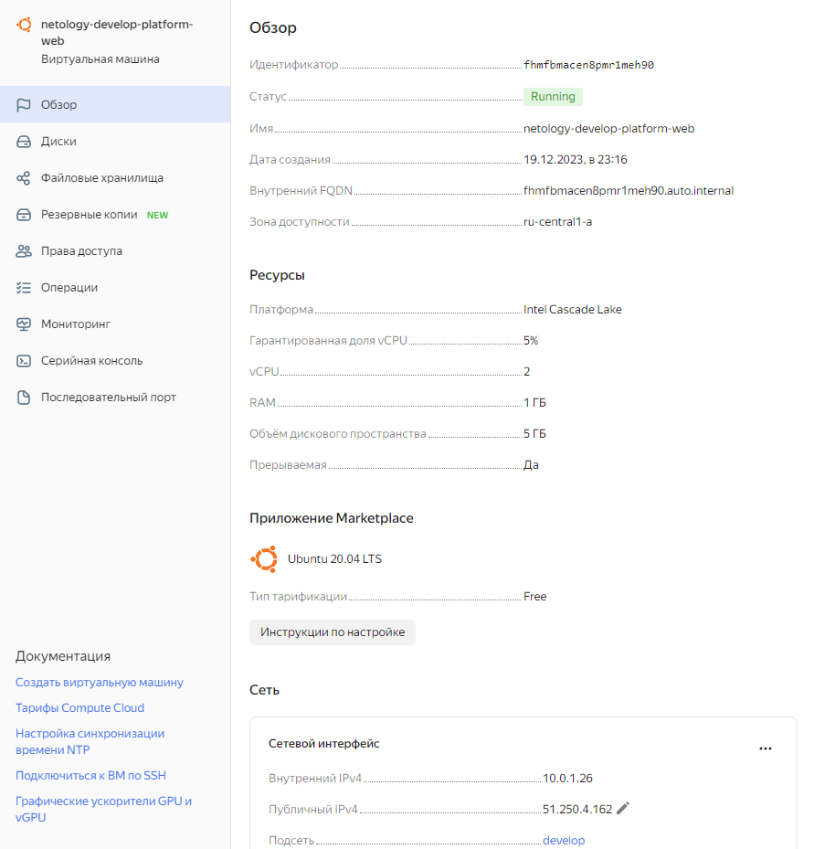
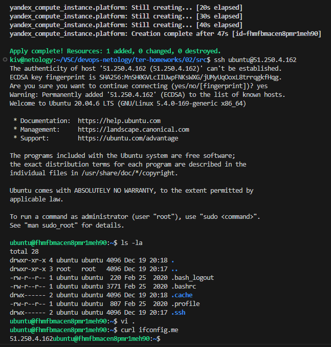
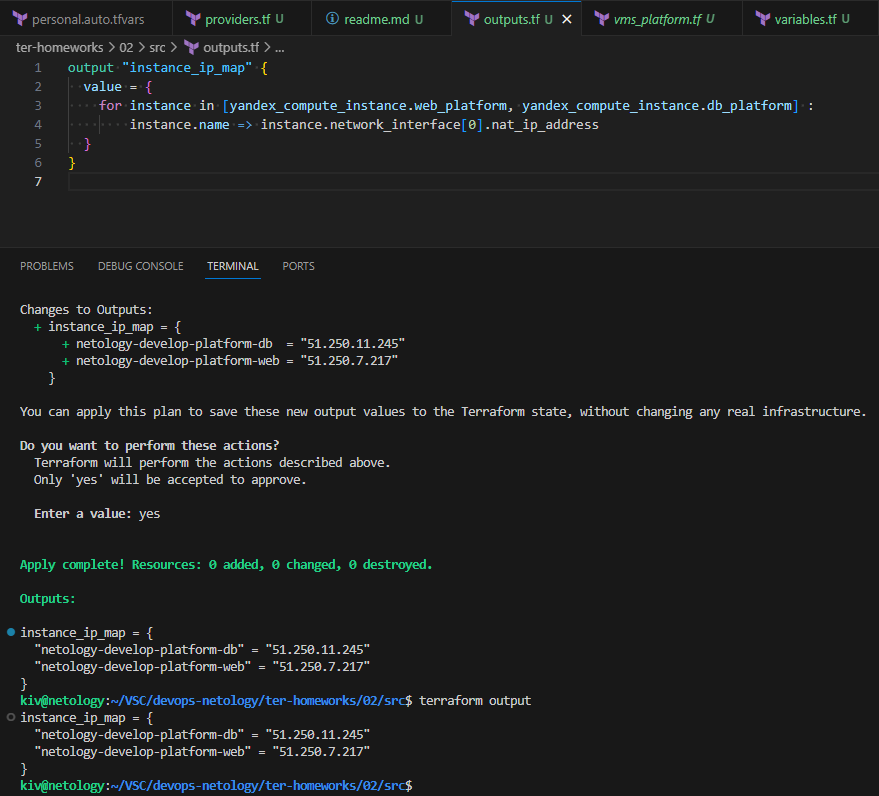
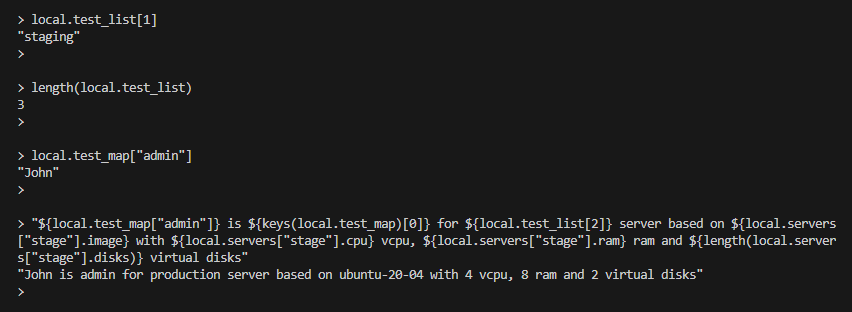

## Задача 1
Допущенные ошибки:
#### 1. platform_id = "standart-v4"
  - опечатка в слове standard
  - указан недоступный вариант

```
platform_id - в Яндекс так называется тип процессора
на данный момент существуют 3 варианта стандартных платформ:
```

https://cloud.yandex.ru/docs/compute/concepts/vm-platforms

```
Intel Broadwell
(standard-v1)	Intel® Xeon® Processor E5-2660 v4

Intel Cascade Lake
(standard-v2)	Intel Xeon Gold 6230

Intel Ice Lake
(standard-v3)
```

самым бюджетным вариантом является
```
platform_id = "standard-v2"
  - исправленное значение
```

#### 2. неверно задано количество ядер
указано 1, для platform_id = "standard-v2" минимальное количество ядер = 2
```
cores = 2
  - исправленное значение
```

--------------------------

#### *1. preemptible = true*
Этот параметр означает, что виртуальная машина будет создана как preemptible, что означает, что она может быть прекращена облаком без предупреждения.

### Основные характеристики preemptible instances:

**Экономия стоимости:** Preemptible instances обычно стоят гораздо дешевле, чем обычные (они же "on-demand") виртуальные машины. Это делает их привлекательным выбором для временных, высоконагруженных задач, которые могут быть прерваны без серьезных последствий.

**Временность:** Preemptible instances предназначены для временных задач и могут быть прекращены в любой момент, когда ресурсы потребуются для других задач. Поэтому они не подходят для постоянных или критически важных служб.

**Запуск в нескольких экземплярах:** Вместо того чтобы заводить одну мощную виртуальную машину, можно использовать несколько preemptible instances для распределения задачи.

#### 2. Значение *core_fraction*
представляет процент от общей мощности ядра, в нашем случае 5%.

--------------------------

ВМ в Yandex Cloud



Консоль, curl



## Задача 2

Изменения в исходном коде

## Задача 3

Изменения в исходном коде

## Задача 4

Значения ip-адресов команды terraform output



## Задача 5

Изменения в исходном коде

## Задача 6

Изменения в исходном коде

## Задача 7*

terraform console


