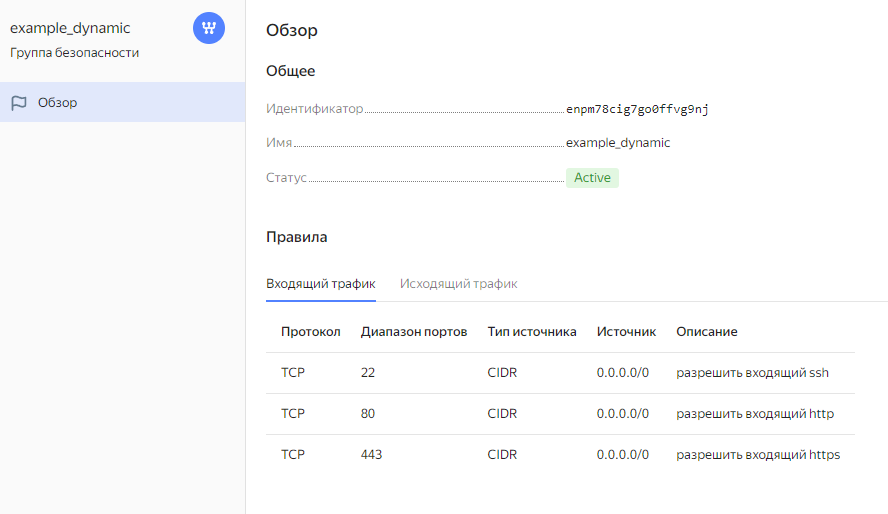
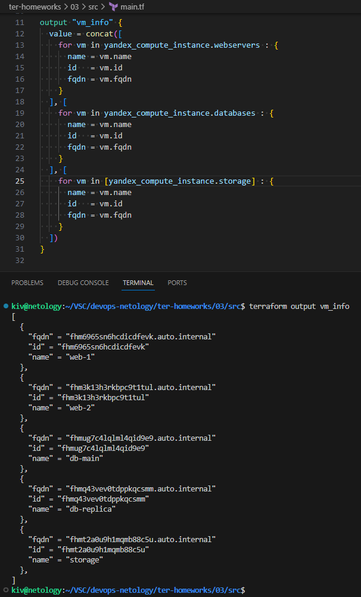
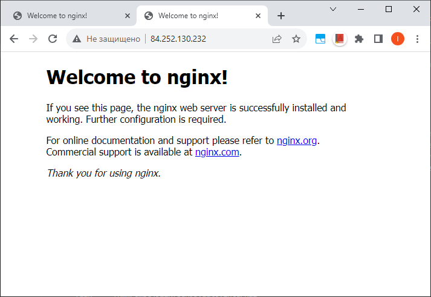
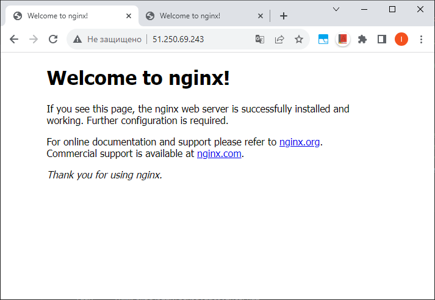

## Домашнее задание

https://github.com/netology-code/ter-homeworks/blob/main/03/hw-03.md

## Задача 1

Входящие правила «Группы безопасности» в ЛК Yandex Cloud

Полезные ссылки:

Группы безопасности
https://cloud.yandex.ru/ru/docs/vpc/concepts/security-groups

Создать группу безопасности
https://cloud.yandex.ru/ru/docs/vpc/operations/security-group-create

## Задача 2

[count-vm.tf](src/count-vm.tf)

[for_each-vm.tf](src/for_each-vm.tf)

[src](src)

## Задача 3

[disk_vm.tf](src/disk_vm.tf)

## Задача 4

[ansible.tf](src/ansible.tf)

[hosts.tftpl](src/hosts.tftpl)

[hosts.cfg](src/hosts.cfg)

[src](src)

## Задача 5*

## Задача 6*

6.1  [ansible.tf](src/ansible.tf)

nginx web-1

nginx web-2

6.2  [hosts.tftpl](src/hosts.tftpl)
