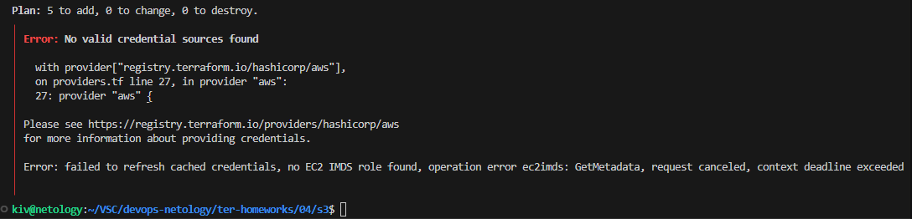
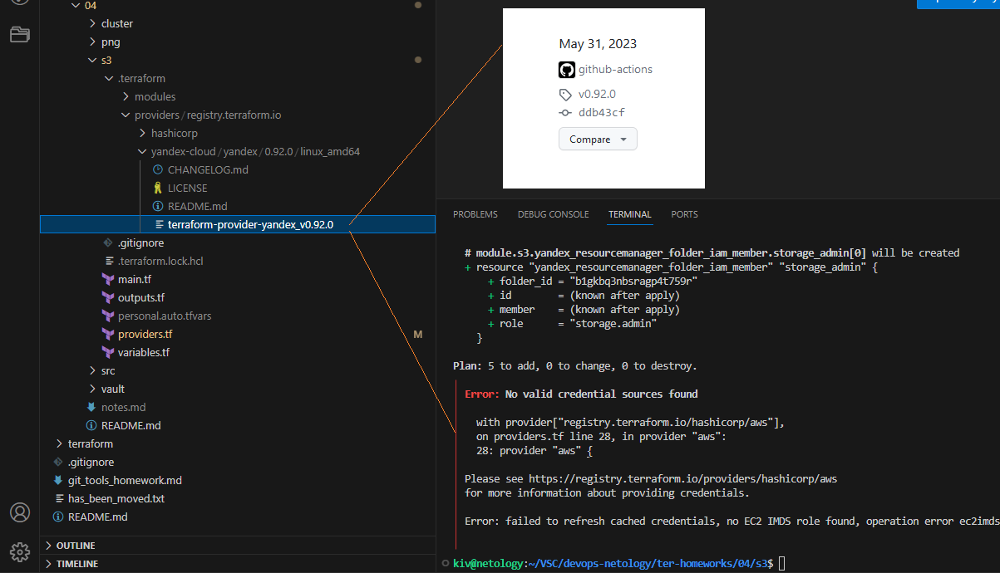
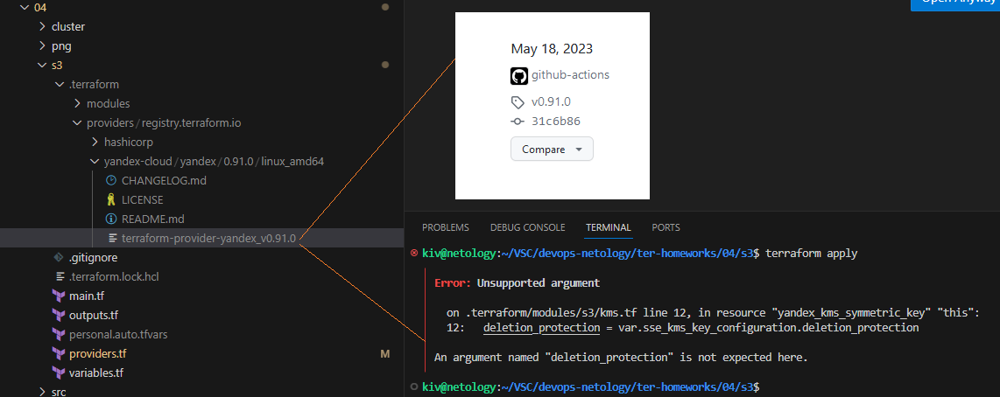
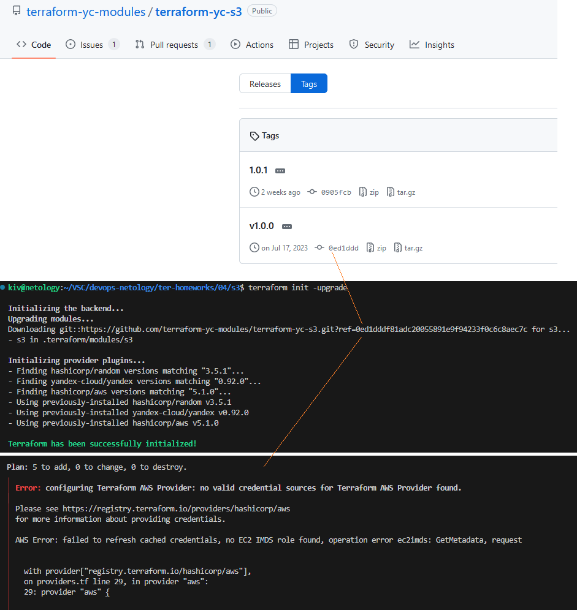
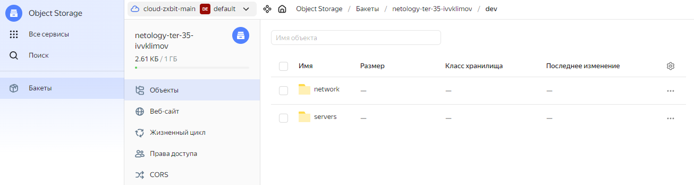
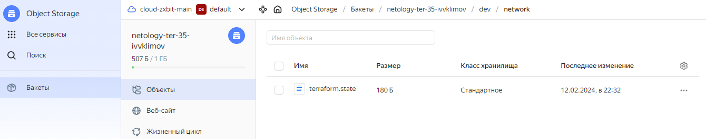
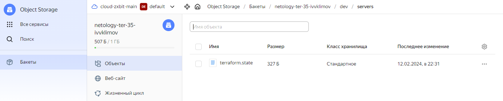

## Домашнее задание

https://github.com/netology-code/ter-homeworks/blob/main/04/hw-04.md

# Основная часть

## Задача 1

Outputs


sudo nginx -t


Yandex Cloud hosts labels


terraform console


## Задача 2

terraform console


Документация к модулю vpc: [README.md](src/modules/vpc/README.md)

## Задача 3
Список ресурсов в стейте
```
terraform state list
```


Удаляем из стейта все подключенные модули
```
terraform state rm module.vpc
terraform state rm module.marketing_vm
terraform state rm module.analytics_vm
```


Восстанавливаем vpc в стейте
```
terraform import module.vpc.yandex_vpc_network.network enp693i3lgv9id7om51h
terraform import module.vpc.yandex_vpc_subnet.subnet e9bpa1s5eatlpdrrak7l
terraform state list
```


Восстанавливаем vm в стейте
```
terraform import module.marketing_vm.yandex_compute_instance.vm[0] fhmkr940afk4s3iuf370
terraform import module.analytics_vm.yandex_compute_instance.vm[0] fhmj3amcjo79ofotrs4v
```


terraform plan
```
При восстановлении vm в стейте не восстанавливается allow_stopping_for_update = true, ставится null
```


# Дополнительные задания

## Задача 4*
Cоздан модуль vpc2.

terraform plan
```
Не применяется, т.к. есть лимит на создаваемые сети.
```


## Задача 5*
Cсылка на проект: [cluster](cluster/)

Практические руководства Managed Service for MySQL

https://cloud.yandex.ru/ru/docs/managed-mysql/tutorials/

Классы хостов MySQL (resource_preset_id)

https://cloud.yandex.ru/docs/managed-mysql/concepts/instance-types


Создаем кластер, ha = false


Создаем базу и пользователя


Yandex Cloud кластер


Yandex Cloud свойство кластера


Yandex Cloud база данных


Добавляем еще один хост в кластер, ha = true


Yandex Cloud свойство кластера


Yandex Cloud хосты кластера


## Задача 6*
Cсылка на проект: [s3](s3/)

При запуске terraform init возникает ошибка



Нашел первую версию яндекс провайдера, на базе которого можно создать бакет s3 с помощью заданного модуля. v0.92.0, там такая же ошибка, что и на последней версии. Посмотрел некоторые промежуточные версии до последней, таже ошибка.



На v0.91.0 другая ошибка



Далее попробовал предыдущую версию модуля относительно коммита тега, такая же ошибка.



У данного модуля есть открытый ишью с такой проблемой:

https://github.com/terraform-yc-modules/terraform-yc-s3/issues/5

```
Далее, по-необходимости, бакет будет создан через gui Yandex Cloud
```

## Задача 7*
Cсылка на проект: [vault](vault/)

terraform output


new secret


## Задача 8*
Cсылка на проект: [remote_state](remote_state/)

Т.к. в задаче 6* s3 модуль не смог создать бакет, создаем его через gui Yandex Cloud. В каждом модуле, который будет работать с S3 создадим файл secret.backend.tfvars и пропишем туда access_key и secret_key.

Подключим файл с секретами backend при инициализации инфраструктуры:
```
terraform init -backend-config=secret.backend.tfvars
```
*При этом terraform подгрузит все параметры, описанные в -backend-config, внутрь блока backend.*

Содержимое бакета в S3 Yandex Cloud



Сохраненный стейт layer1-network



Сохраненный стейт layer2-servers



```
p.s. После создания скриншотов вносил корректиировку в название модулей, возможно расхождение
```
