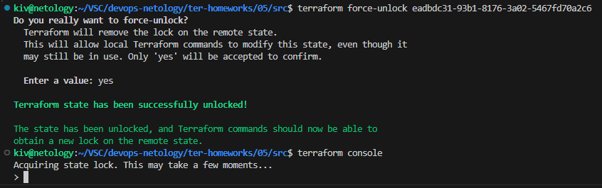
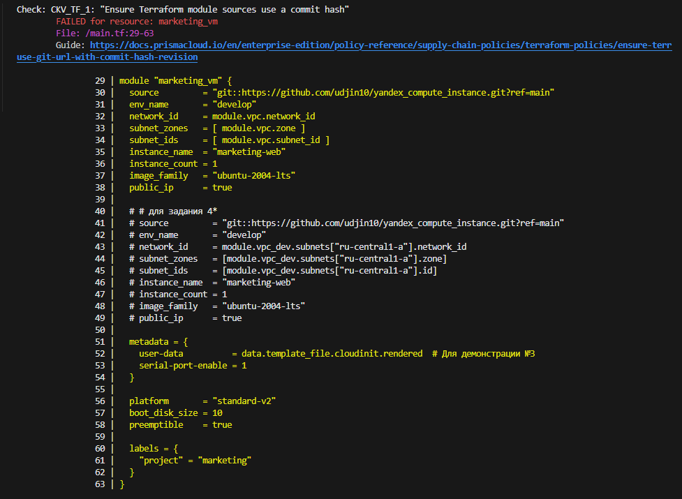
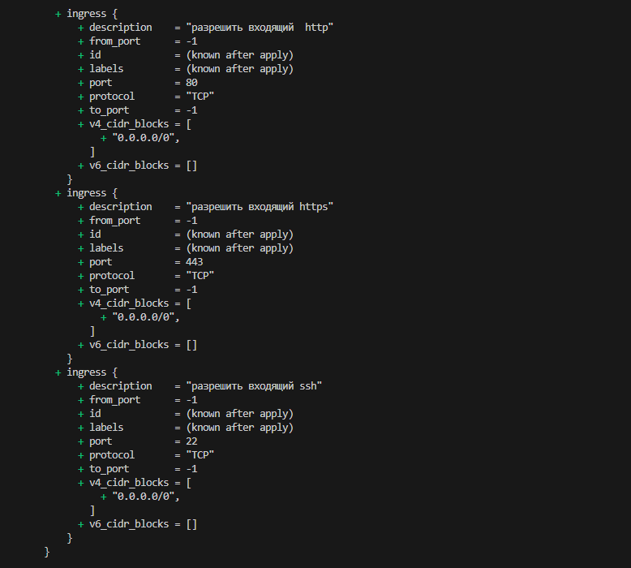

## Домашнее задание

https://github.com/netology-code/ter-homeworks/blob/main/05/hw-05.md

# Основная часть

## Задача 1

### tflint

> [demonstration1](01/demonstration1/)

*Здесь необходимо выполнить terraform init*


> [src](01/src/)

*Здесь 4 предупреждения, одно связано с необходимостью указать версию yandex провайдера и 3 остальных с объявленными, но неиспользуемыми переменными*


### checkov

> [demonstration1](01/demonstration1/)

Типы ошибок:

```
Check: CKV_TF_1: "Ensure Terraform module sources use a commit hash"
Check: CKV_YC_2: "Ensure compute instance does not have public IP."
Check: CKV_YC_11: "Ensure security group is assigned to network interface."
```


> [src](01/src/)

Ошибок не найдено


## Задача 2

В 4 задании было реализовано несколько проектов. Возьму тот, который создает marketing-web и analytics_vm и перенесу его стейт в S3. В следующем задании сделаю hotfix на данный проект по результатам работы tflint и checkov.

Для этого скопирую папку проекта ([src](../04/src/)) из домашнего задания 4 в папку ([src](src/)) текущего домашнего задания 5.

В Yandex Cloud создаем сервисный аккаунт **tfstate** и добавляем к нему роли


Создаем статический ключ доступа

*Будет использоваться при описании **backend "s3"** в terraform*


Для созданного аккаунта выдаем права на бакет


Создадим файл secret.backend.tfvars и пропишем туда access_key и secret_key с данными статического ключа, сформированного ранее.

Подключим файл с секретами backend при инициализации инфраструктуры:
```
terraform init -backend-config=secret.backend.tfvars
```
*При этом terraform подгрузит все параметры, описанные в -backend-config, внутрь блока backend.*

После данной процедуры локальный стейт очищается и он появляется в S3:


### Настраиваем блокировку стейта

Создаем базу данных YDB


Создаем таблицу


Добавляем настройки в **backend "s3"**


Перенастраиваем стейт

```
terraform init -migrate-state -backend-config=secret.backend.tfvars
```


Запускаем консоль terraform в первом терминале

```
terraform console
```


Запускаем консоль terraform во втором терминале и видим сообщение, что стейт заблокирован

```
terraform console
```


Во втором терминале принудительно разблокируем стейт и войдем в консоль terraform

```
terraform force-unlock eadbdc31-93b1-8176-3a02-5467fd70a2c6
terraform console
```



В первом терминале нажимаем Ctrl+C и видим сообщение, что стейт был заблокирован


В момент, когда стейт заблокирован, в нашей таблице в YDB появляется соответствующая информация


## Задача 3

Из ветки ter-05 создаем ветку ter-05-hotfix

Переходим в корень проекта terraform [src](src)

Создаем файл [.tflint.hcl](01/src/.tflint.hcl)

Запускаем проверку **tflint**

```
docker run --rm -v "$(pwd):/tflint" ghcr.io/terraform-linters/tflint --chdir /tflint
```

Получаем следующий список предупреждений


Запускаем проверку **checkov**

docker run --rm --tty --volume $(pwd):/tf --workdir /tf bridgecrew/checkov \
--download-external-modules true --directory /tf

Получаем следующий список предупреждений





https://www.checkov.io/5.Policy%20Index/terraform.html

**Check: CKV_YC_2: "Ensure compute instance does not have public IP."**
https://github.com/bridgecrewio/checkov/blob/main/checkov/terraform/checks/resource/yandexcloud/ComputeVMPublicIP.py

Если нам необходим внешний доступ, то мы можем проигнорировать предупреждение CKV_YC_2. Предупреждение связано с тем, что включенная опция nat может повлечь за собой риски безопасности, но если мы осознанно приняли это решение и наша конфигурация работает в рамках наших требований, то предупреждение можно проигнорировать.

**Check: CKV_YC_11: "Ensure security group is assigned to network interface."**
https://github.com/bridgecrewio/checkov/blob/main/checkov/terraform/checks/resource/yandexcloud/ComputeVMSecurityGroup.py

Для виртуальных машин необходимо задать группу безопасности.

После внесения правок повторная проверка **tflint** не показывает замечаний


Проверка с помощью **checkov** также показывает успешное завершение


```
terraform plan
```





## Задача 4


# Дополнительные задания

## Задача 5*


## Задача 6*


## Задача 7*

